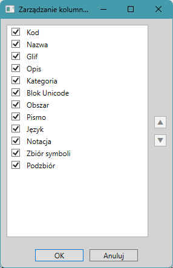

Package Qhta.SF.WPF.Tools is a library for extending Syncfusion WPF controls functionality.

*Note: Trying to name it “Qhta.Syncfusion.WPF.Tools” result compiling errors due to Visual Studio C# namespace resolving policy!*

The package contains:
- [Default SfDataGrid styles and templates](#default-sfdatagrid-styles-and-templates),
- [SfDataGrid column and row selection functionality](#SfDataGrid-column-and-row-selection-functionality),
- [Individual SfDataGrid row resizing functionality](#individual-sfdatagrid-row-resizing-functionality),
- [LongTextColumn template and functionality](#longtextcolumn-template-and-functionality),
- [RecordNavigationBar](#recordnavigationbar),
- [Clipboard operations on SfDataGrid](#clipboard-operations-on-sfdatagrid),
- [SfDataGridFiltering tools](#sfdatagridfiltering-tools),
- [SfDataGridFinder class and commanding](#sfdatagridfinder-class-and-commanding),
- [Fill Column Command](#fill-column-command),
- [Column Management Command](#column-management-command),
- [Behavior extensions for SfDataGrid and GridColumn classes](#behavior-extensions-for-sfdatagrid-and-gridcolumn-classes).

# Default SfDataGrid styles and templates

The SfDataGridTools resource dictionary contains styles, converters and data templates extending functionality of the original SfDataGrid. 
Some of the style resources only contain specific default property setters, 
some are extracted from the original Syncfusion.SfGrid.WPF resources and extended with new templates. 
The resource dictionary code-behind functionality is also provided in the SfDataGridTools.cs file. 

Used styles provide a SfDataGrid layout with a grayed column headers row and grayed row headers column.


## Default SfDataGrid style settings

The default style for SfDataGrid is defined as below:

```xml
  <Style TargetType="sf:SfDataGrid">
    <Setter Property="AllowDraggingColumns" Value="True" />
    <Setter Property="AllowEditing" Value="True" />
    <Setter Property="AllowFiltering" Value="True" />
    <Setter Property="AllowResizingColumns" Value="True" />
    <Setter Property="AllowSorting" Value="True" />
    <Setter Property="AllowTriStateSorting" Value="True" />
    <Setter Property="AllowDeleting" Value="True" />
    <Setter Property="ColumnSizer" Value="Auto" />
    <Setter Property="HeaderRowHeight" Value="26" />
    <Setter Property="AutoGenerateColumns" Value="False" />
    <Setter Property="GridValidationMode" Value="InEdit" />
    <Setter Property="EditTrigger" Value="OnTap" />
    <Setter Property="EnableDataVirtualization" Value="True" />
    <Setter Property="GridCopyOption" Value="CopyData,IncludeFormat" />
    <Setter Property="SelectionUnit" Value="Any" />
    <Setter Property="SelectionMode" Value="Extended" />
    <Setter Property="ShowRowHeader" Value="True" />
    <Setter Property="tools:SfDataGridBehavior.AllowColumnManagement" Value="True" />
    <EventSetter Event="Loaded" Handler="DataGrid_OnLoaded"/>
    <EventSetter Event="KeyDown" Handler="DataGrid_OnKeyDown"/>
  </Style>
```

Both event handlers are implemented in the code-behind in the SfDataGridTools.xaml.cs file.

### SfDataGrid OnLoaded event handler

SfDataGrid Loaded event is needed to initialize these event handlers, which are not RoutedEvent handlers
and can not be initialized in xaml. Also GridCopyContent and GridPasteContent event handlers must be initiated.

```csharp
  private void DataGrid_OnLoaded(object? sender, EventArgs e)
  {
    if (sender is not SfDataGrid dataGrid)
      return;
    dataGrid.QueryRowHeight += DataGrid_OnQueryRowHeight;
    dataGrid.FilterItemsPopulating += DataGrid_OnFilterItemsPopulating;
    dataGrid.FilterChanged += DataGrid_OnFilterChanged;
    // Attach event handlers for copy and paste operations
    dataGrid.GridCopyContent += DataGrid_OnGridCopyContent;
    dataGrid.GridPasteContent += DataGrid_OnGridPasteContent;
  }
```
In contrast to the above events, KeyDown event is a RoutedEvent and is initialized in SfDataGrid default style (see above).

### SfDataGrid OnQueryRowHeight event handler

QueryRowHeight simply invokes OnQueryRowHeight method of the RowHeightProvider static class. 
This method checks if the appropriate record of the SfDataGrid.View.Records collection implements IRowHeightProvider interface
and sets event args Height property to its RowHeight property value. If this value is not NaN, the event is just handled.

If the QueryRowHeight event is not handled by RowHeightProvider then SfDataGrid invokes OnQueryRowHeight method 
of the LongTextColumn class (both classes are described further below).

```csharp
  private void DataGrid_OnQueryRowHeight(object? sender, QueryRowHeightEventArgs e)
  {
    RowHeightProvider.OnQueryRowHeight(sender, e);
    if (e.Handled)
      return;
    LongTextColumn.OnQueryRowHeight(sender, e);
  }
```

### SfDataGrid OnFilterItemsPopulating and OnFilterChanged event handlers

These methods handle events used in data filtering.
They simply redirect invocations to SfDataGridFiltering static class appropriate methods.

```csharp
  private void DataGrid_OnFilterItemsPopulating(object? sender, GridFilterItemsPopulatingEventArgs e) => SfDataGridFiltering.OnFilterItemsPopulating(sender, e);

  private void DataGrid_OnFilterChanged(object? sender, GridFilterEventArgs e) => SfDataGridFiltering.OnFilterChanging(sender, e);
```

### SfDataGrid OnGridCopyContent and OnGridPasteContent event handlers

These handlers use SfDataGridCommander static class and its CanCopyData, CopyData, CanPasteData, and PasteData appropriately.
These handlers are needed because in specific (and not very clear) conditions the internal logic of SfDataGrid tries 
to copy or paste data ommiting Copy and Paste commands.

```csharp
  private void DataGrid_OnGridCopyContent(object? sender, GridCopyPasteEventArgs e)
  {
    if (sender is not SfDataGrid dataGrid)
      return;
    if (SfDataGridCommander.CanCopyData(dataGrid))
    {
      SfDataGridCommander.CopyData(dataGrid);
      e.Handled = true;
    }
  }

  private void DataGrid_OnGridPasteContent(object? sender, GridCopyPasteEventArgs e)
  {
    if (sender is not SfDataGrid dataGrid)
      return;
    if (SfDataGridCommander.CanPasteData(dataGrid))
    {
      SfDataGridCommander.PasteData(dataGrid);
      e.Handled = true;
    }
  }
```

Note that there are no similar CutData nor DeleteData events declared in the original SfDataGrid.

### SfDataGrid OnKeyDown event handler

This method handles common command shortcuts:
- Ctrl-C key combination to invoke SfDataGridCommander.CopyData method,
- Ctrl-X key combination to invoke SfDataGridCommander.CutData method,
- Ctrl-V key combination to invoke SfDataGridCommander.PasteData method,
- Delete key to invoke SfDataGridCommander.DeleteData method,
- Ctrl-F key combination to invoke FindCommand.Execute method,
- F3 key to invoke FindCommand.ExecuteNext method.

```csharp
  private void DataGrid_OnKeyDown(object sender, KeyEventArgs e)
  {
    if (sender is not SfDataGrid dataGrid)
      return;
    FindAndReplaceCommand findCommand;
    switch (e.Key)
    {
      case Key.C when Keyboard.Modifiers == ModifierKeys.Control:
        SfDataGridCommander.CopyData(dataGrid);
        e.Handled = true;
        return;
      case Key.X when Keyboard.Modifiers == ModifierKeys.Control:
        SfDataGridCommander.CutData(dataGrid);
        e.Handled = true;
        return;
      case Key.V when Keyboard.Modifiers == ModifierKeys.Control:
        SfDataGridCommander.PasteData(dataGrid);
        e.Handled = true;
        return;
      case Key.Delete when Keyboard.Modifiers == ModifierKeys.None:
        SfDataGridCommander.DeleteData(dataGrid);
        e.Handled = true;
        return;
      case Key.F when Keyboard.Modifiers == ModifierKeys.Control:
        findCommand = new FindAndReplaceCommand();
        if (findCommand.CanExecute(dataGrid))
        {
          findCommand.Execute(dataGrid);
          e.Handled = true;
        }
        return;
      case Key.F3 when Keyboard.Modifiers == ModifierKeys.None:
        findCommand = new FindAndReplaceCommand();
        if (findCommand.CanExecuteFindNext(dataGrid))
        {
          findCommand.ExecuteFindNext(dataGrid);
          e.Handled = true;
        }
        return;
    }
  }

```


# SfDataGrid Column and row selection functionality

Original SfDataGrid lets user to select cells or whole rows. It lacks of column selection.

## The whole SfDataGrid column selection


Default styles for GridHeaderCellControl, GridCell are defined to let the application to select the grid columns, 
and mark them by gray background.

When nothing is selected, the column header row and row header column are displayed with silver background with graphite foreground 
and the grid cell background is transparent.

When the column is selected, its header cell background turns to dark gray, and its cells background turns to silver. 
The appropriate styles are named as "SelectedColumnHeaderStyle", "SelectedGridCellStyle" and "UnselectedGridCellStyle".
Default GridHeaderCellControl style has no name (as required for default styles).

```xml
  <Style TargetType="sf:GridHeaderCellControl">
    <Setter Property="Foreground" Value="#FF404040" />
    <Setter Property="Background" Value="Silver" />
    <EventSetter Event="PreviewMouseDown" Handler="GridHeaderCellControl_MouseLeftButtonDown" />
    <EventSetter Event="PreviewMouseDown" Handler="GridHeaderCellControl_MouseRightButtonDown"  />  
  </Style>

  <Style TargetType="sf:GridHeaderCellControl" x:Key="SelectedColumnHeaderStyle">
    <Setter Property="Foreground" Value="#FF404040" />
    <Setter Property="Background" Value="#FFA0A0A0" />
    <EventSetter Event="PreviewMouseDown" Handler="GridHeaderCellControl_MouseLeftButtonDown" />
    <EventSetter Event="PreviewMouseDown" Handler="GridHeaderCellControl_MouseRightButtonDown"  />
  </Style>

  <Style TargetType="sfx:GridCell" x:Key="UnselectedGridCellStyle">
    <Setter Property="Background" Value="Transparent" />
  </Style>

  <Style TargetType="sfx:GridCell" x:Key="SelectedGridCellStyle">
    <Setter Property="Background" Value="Silver" />
  </Style>

```

The GridHeaderCellControl style handles MouseLeftButtonDown event to let the user to select the whole column with mouse click on the column's header cell. 
The code-behind method is rather sophisticated as we must enable user to click filter button and the sorting marker at the right of the header cell.
So if the column allows filtering, we set the right margin limit to 20 pcx, and if the column allows sorting, we add more 20 pcx to the right margin limit.
We must also enable user to resize columns by dragging their left edges, so we set the small (5 pcx) left margin limit. 
We continue to handle the mouse click only if its position is between left and right margin limits.

```csharp
  private void GridHeaderCellControl_MouseLeftButtonDown(object sender, MouseButtonEventArgs e)
  {
    if (sender is GridHeaderCellControl headerCellControl && e.ChangedButton == MouseButton.Left)
    {
      var column = headerCellControl.Column;
      if (column == null) return;
      var dataGrid = headerCellControl.FindParent<SfDataGrid>();
      if (dataGrid == null) return;
      if (column.AllowFiltering || column.AllowSorting)
      {
        var rightMarginLimit = 0;
        if (column.AllowFiltering)
          // If the column allows filtering, we can check if the mouse is on the filter icon
          rightMarginLimit += 20; // Assuming the filter icon is 20px wide
        if (column.AllowSorting)
          // If the column allows sorting, we can check if the mouse is on the sort icon
          rightMarginLimit += 20; // Assuming the sort icon is 20px wide
        // Small margins are used to avoid accidental selection when clicking near the left or right edge of the header cell
        if (rightMarginLimit == 0)
          rightMarginLimit = ResizeMargin;
        var leftMarginLimit = ResizeMargin; // Assuming a small margin on the left side
        var mousePosition = e.GetPosition(headerCellControl);
        if (mousePosition.X >= headerCellControl.ActualWidth - rightMarginLimit)
          // If mouse is on the filter icon, do open filter popup instead of selecting the column
          return;
        if (mousePosition.X <= leftMarginLimit)
          // If mouse is near the left edge, do not select the column.
          // Instead, the user may click on the column separator line to resize the column.
          return;
      }
```

We use SfDataGridColumnBehavior to mark the column as selected. 
We do not use the SfDataGrid.SelectionController to select all the cells in the column separately because of the two reasons. 
First, because of the performance of selection. When the data grid contains a large number of rows, selection of all the cells in the column takes much time.
Second reason is to let the application to load the data of the grid in the background task. 
If we would select the cells of the column separately, the cells in rows which data have not been loaded yet, would stay unmarked.
Instead we use the data grid SelectionController to ClearSelections if some cells they were selected separately.

```csharp
      dataGrid.SelectionController.ClearSelections(false);
      var isSelected = SfDataGridColumnBehavior.GetIsSelected(column);
      isSelected = !isSelected;
```

Next we handle keyboard modifier as Shift and Control. 
If none of them is pressed, only the currently clicked column is selected, and other columns are unselected.
If only the Control modifier key is pressed, no other columns are unselected.
If the Shift modifier key is pressed (and Control modifier is not pressed), 
then all the column between the currently clicked column the previously selected columns are selected.
As the columns are represented by the indexed collection, we find the last prior (left) selected column index and the first next (right) selected column index.
If the previously selected columns where both on the left and on the right of the currently clicked column, 
all the columns between the current and the nearest one are marked as selected.

```csharp
      if (!Keyboard.Modifiers.HasFlag(ModifierKeys.Shift) && !Keyboard.Modifiers.HasFlag(ModifierKeys.Control))
        // Clear selection if Shift or Control is not pressed
        foreach (var col in dataGrid.Columns)
          if (col != column)
            SfDataGridColumnBehavior.SetIsSelected(col, false);
      if (Keyboard.Modifiers == ModifierKeys.Shift && isSelected)
      {
        var selectedColumnIndex = dataGrid.Columns.IndexOf(column);
        int? lastPriorSelectedColumnIndex = null;
        int? firstNextSelectedColumnIndex = null;
        for (var i = 0; i < dataGrid.Columns.Count; i++)
        {
          var col = dataGrid.Columns[i];
          if (SfDataGridColumnBehavior.GetIsSelected(col))
          {
            if (i < selectedColumnIndex) lastPriorSelectedColumnIndex = i;
            else if (i > selectedColumnIndex) firstNextSelectedColumnIndex = i;
          }
        }
        if (lastPriorSelectedColumnIndex != null || firstNextSelectedColumnIndex != null)
        {
          if (lastPriorSelectedColumnIndex != null && (firstNextSelectedColumnIndex == null ||
                                                          firstNextSelectedColumnIndex - selectedColumnIndex >=
                                                          selectedColumnIndex - lastPriorSelectedColumnIndex))
            // Select all columns from last previous selected to current
            for (var i = lastPriorSelectedColumnIndex.Value + 1; i < selectedColumnIndex; i++)
            {
              var col = dataGrid.Columns[i];
              if (col != column) SfDataGridColumnBehavior.SetIsSelected(col, isSelected);
            }
          if (firstNextSelectedColumnIndex != null && (lastPriorSelectedColumnIndex == null ||
                                                       firstNextSelectedColumnIndex - selectedColumnIndex >=
                                                       selectedColumnIndex - lastPriorSelectedColumnIndex))
            // Select all columns from current to first next selected
            for (var i = selectedColumnIndex + 1; i < firstNextSelectedColumnIndex.Value; i++)
            {
              var col = dataGrid.Columns[i];
              if (col != column) SfDataGridColumnBehavior.SetIsSelected(col, isSelected);
            }
        }
      }

      //Debug.WriteLine($"GridColumnBehavior.IsSelected: {isSelected} for column: {column.MappingName}");
      SfDataGridColumnBehavior.SetIsSelected(column, isSelected);
      e.Handled = true;
    }
  }
```

SfDataGridColumnConverter class is used to provide a mechanism to get a GridColumn object "IsSelected" property for data binding in SfDataGrid. 

```csharp
public class SfDataGridColumnConverter: IValueConverter
{
  public object? Convert(object? value, Type targetType, object? parameter, CultureInfo culture)
  {
    if (value is GridColumn column)
    {
      if (parameter is not string propName)
        throw new InvalidOperationException("Parameter should be string");
      if (propName == "IsSelected")
        return SfDataGridColumnBehavior.GetIsSelected(column);
      else
        throw new InvalidOperationException("Property name not recognized");
    }
    throw new NotImplementedException();
  }
```

## The whole SfDataGrid row selection

The whole row selection is handled by the original SfDataGrid, so we do not need to handle it in SfDataGridTools. 
If the SfDataGrid SelectionUnit property is set to Any, then when the user click the row header, all the cells in the row are selected.

## The whole data selection

The user can select the whole data in the data grid by clicking the "cell" at the crossing of the column headers row and row headers column.
This cell control type is GridRowIndencCell, and its style declared in the SfDataGridTools resource dictionary sets the event handler of the MouseLeftButtonDown event.

```xml
  <Style TargetType="sf:GridRowHeaderIndentCell">
    <Setter Property="Background" Value="Silver" />
    <EventSetter Event="PreviewMouseDown" Handler="GridRowHeaderIndentCell_MouseLeftButtonDown" />
  </Style>
```

Its implementation in code-behing simply selects or unselects all columns of the data grid. 
It uses the extension methods AreAllColumnSelected and SelectAllColumns implemented in SfDataGridSelector static class.

```csharp
  private void GridRowHeaderIndentCell_MouseLeftButtonDown(object sender, MouseButtonEventArgs e)
  {
    if (sender is GridRowHeaderIndentCell indentCell && e.ChangedButton == MouseButton.Left)
    {
      var dataGrid = indentCell.FindParent<SfDataGrid>();
      if (dataGrid == null) return;

      dataGrid.SelectAllColumns(!dataGrid.AreAllColumnsSelected());
      e.Handled = true;
    }
  }
```

# Individual SfDataGrid row resizing functionality

SfDataGrid has AllowResizingColumns property which lets the user to resize columns by dragging their edges, but there is no AllowsResizingRows property.
Original SfDataGrid allows the application to evaluate the individual rows heights by the QueryRowHeight event, 
but it lacks user functionality to manipulate the heights.

To fill this gap, we defined a control named RowResizer (as a descender of Thumb control). 

```xml
  <Style x:Key="{x:Type tools:RowResizer}" Style.TargetType="{x:Type tools:RowResizer}" >
    <Setter Property="Control.Background" Value="#01000000" />
    <Setter Property="Control.Template">
      <Setter.Value>
        <ControlTemplate ControlTemplate.TargetType="{x:Type tools:RowResizer}">
          <Border BorderBrush="{TemplateBinding Control.BorderBrush}" 
                  BorderThickness="{TemplateBinding Control.BorderThickness}" 
                  Background="{TemplateBinding Control.Background}"/>
        </ControlTemplate>
      </Setter.Value>
    </Setter>
  </Style>
```

The dependency properties of this control are: 
- MinRowHeight - set by default to 24,
- MaxRowHeight - set by default to 120.

```csharp
  public static readonly DependencyProperty MinRowHeightProperty =
    DependencyProperty.Register(nameof(MinRowHeight), typeof(double), typeof(RowResizer), new FrameworkPropertyMetadata(24.0));

  public double MinRowHeight
  {
    [DebuggerStepThrough] get => (double)GetValue(MinRowHeightProperty);
    set => SetValue(MinRowHeightProperty, value);
  }
  public static readonly DependencyProperty MaxRowHeightProperty =
    DependencyProperty.Register(nameof(MaxRowHeight), typeof(double), typeof(RowResizer), new FrameworkPropertyMetadata(120.0));

  public double MaxRowHeight
  {
    [DebuggerStepThrough] get => (double)GetValue(MaxRowHeightProperty);
    set => SetValue(MaxRowHeightProperty, value);
  }
```

RowResizer control handles LeftMouseDown, MouseMove, and LeftMouseUp to let user to drag this control. 
To resize the row, its dataContext must implement IRowHeightProvider interface. 
This interface declares a single RowHeight property to store the current row height.

```csharp
  private static void OnMouseLeftButtonDown(object sender, MouseButtonEventArgs e)
  {
    if (sender is RowResizer rowResizer && e.ChangedButton == MouseButton.Left)
    {
      var rowHeaderCell = rowResizer.FindParent<GridRowHeaderCell>();
      if (rowHeaderCell == null) return;
      var dataGrid = rowHeaderCell.FindParent<SfDataGrid>();
      if (dataGrid == null) return;

      if (rowResizer.DataContext is not IRowHeightProvider) return;

      var position = e.GetPosition(rowResizer);
      var actualHeight = rowResizer.ActualHeight;

      if (SfDataGridBehavior.GetAllowRowResizing(dataGrid))
      {
        if (!SfDataGridBehavior.GetIsRowResizing(dataGrid))
        {
          // If the grid allows row resizing and is not currently resizing rows, set the state to resizing
          SfDataGridBehavior.SetStartOffset(dataGrid, actualHeight - position.Y);
          SfDataGridBehavior.SetIsRowResizing(dataGrid, true);
          Mouse.Capture(rowResizer);
          e.Handled = true;
        }
      }
    }
  }
```

```csharp
  private static void OnMouseMove(object sender, MouseEventArgs e)
  {
    if (sender is RowResizer rowResizer)
    {
      var rowHeaderCell = rowResizer.FindParent<GridRowHeaderCell>();
      if (rowHeaderCell == null) return;
      var dataGrid = rowHeaderCell.FindParent<SfDataGrid>();
      if (dataGrid == null) return;

      if (rowHeaderCell.DataContext is not IRowHeightProvider rowHeightProvider)
        return;

      if (SfDataGridBehavior.GetIsRowResizing(dataGrid))
      {
        var position = e.GetPosition(rowHeaderCell);
        var requestedHeight = position.Y + SfDataGridBehavior.GetStartOffset(dataGrid);
        if (!double.IsNaN(rowResizer.MinRowHeight) && requestedHeight < rowResizer.MinRowHeight)
          requestedHeight = rowResizer.MinRowHeight;
        if (!double.IsNaN(rowResizer.MaxRowHeight) && requestedHeight > rowResizer.MaxRowHeight)
          requestedHeight = rowResizer.MaxRowHeight;

        rowHeightProvider.RowHeight = requestedHeight;
        e.Handled = true;
        dataGrid.View.Refresh();
      }
    }
  }
```

```csharp
  private static void OnMouseLeftButtonUp(object sender, MouseButtonEventArgs e)
  {
    if (sender is RowResizer rowResizer && e.ChangedButton == MouseButton.Left)
    {
      var rowHeaderCell = rowResizer.FindParent<GridRowHeaderCell>();
      if (rowHeaderCell == null) return;
      var grid = rowHeaderCell.FindParent<SfDataGrid>();
      if (grid == null) return;

      if (SfDataGridBehavior.GetIsRowResizing(grid))
      {
        SfDataGridBehavior.SetIsRowResizing(grid, false);
        Mouse.Capture(null);
        e.Handled = true;
      }
    }
  }
```

The application can switch the row resizing functionality on by using SfDataGridBehavior AllowRowResizing attached property. 
RowResizer control uses SfDataGridBehavior IsRowResizing attached property to mark the state between LeftMouseDown and LeftMouseUp 
and let the user to drag the boundary between rows.

The new GridRowHeaderCell style is named as "ResizedGridRowHeaderCellStyle". 
It differs from the original GridRowHeaderCellStyle in the content of "PART_RowHeaderIndicatorGrid", where we included RowResizer.
If the PART_RowHeaderIndicatorGrid is visible, the appropriate row's height can be increased or decreased 
by dragging the bottom edge of the row header cell down and up.

```xml
  <Style TargetType="{x:Type sf:GridRowHeaderCell}" x:Key="ResizedGridRowHeaderCellStyle" >
    <Setter Property="Background" Value="Silver" />
    <Setter Property="BorderBrush" Value="#FF808080" />
    <Setter Property="BorderThickness" Value="0,0,1,1" />
    <Setter Property="Foreground" Value="#FF303030" />
    <Setter Property="Padding" Value="0,0,0,0" />
    <Setter Property="FocusVisualStyle" Value="{x:Null}" />
    <Setter Property="IsTabStop" Value="False" />
    <Setter Property="RowErrorMessage" Value="{Binding ErrorMessage}" />
    <Setter Property="Template">
      <Setter.Value>
        <ControlTemplate>
          <Border Name="PART_RowHeaderCellBorder" Background="{TemplateBinding Background}" BorderBrush="{TemplateBinding BorderBrush}" BorderThickness="{TemplateBinding BorderThickness}">
            ...
            <Grid x:Name="PART_RowHeaderIndicatorGrid" Panel.Background="#00FFFFFF">
              <Path x:Name="PART_RowHeaderIndicator" 
                    Width="8.146" 
                    Height="8.146" 
                    HorizontalAlignment="Center" 
                    VerticalAlignment="Center" 
                    Fill="#FF303030" 
                    Stretch="Fill" />
              <tools:RowResizer Visibility="{Binding Path=(tools:SfDataGridBehavior.AllowRowResizing), 
                         RelativeSource={RelativeSource AncestorType={x:Type sf:SfDataGrid}}, 
                         Converter={StaticResource BoolToVisibilityConverter}}" />
              <ToolTipService.ToolTip>
                <ToolTip Name="PART_ToolTip" Background="#FFDB000C" Placement="Left" 
                           PlacementRectangle="20,0,0,0" Tag="{TemplateBinding sf:GridRowHeaderCell.RowErrorMessage}" 
                           Template="{DynamicResource ValidationToolTipTemplate}" Visibility="Collapsed"/>
              </ToolTipService.ToolTip>
            </Grid>
          </Border>
        </ControlTemplate>
      </Setter.Value>
    </Setter>
  </Style>
```

As the current row height is stored in the row's data context RowHeight property, this functionality requires that the data grid handles 
QueryRowHeight event. The event handler is implemented in code-behind in the SfDataGridTools.cs file.

```csharp
  private void DataGrid_OnQueryRowHeight(object? sender, QueryRowHeightEventArgs e)
  {
    RowHeightProvider.OnQueryRowHeight(sender, e);
    if (e.Handled)
      return;
    LongTextColumn.OnQueryRowHeight(sender, e);
  }
```

Individual row resizing may be useful if we want to increase the row height temporary as the following sample.


# LongTextColumn template and functionality

Original Syncfusion WPF library defines several types of column. GridTextColumn is one of them, and it operates on String data.
However its cell template is limited to simple TextBox functionality, which is not enough if the cell content string is long.

LongTextColumn class was thought as an extension for the original GridTextColumn. 
However as we need to define new template, it is declared as an extension for GridTemplateColumn class.

```csharp
public class LongTextColumn : GridTemplateColumn
{
  public LongTextColumn()
  {
    CellTemplate = (DataTemplate)Application.Current.Resources["LongTextCellTemplate"]!;
    EditTemplate = (DataTemplate)Application.Current.Resources["LongTextEditTemplate"]!;
  }
```

LongTextColumn provides sophisticated functionality for those SfDataGrid colums which are mapped to string-typed properties with no length limit. 
When the column is wide enough to display the whole text content, its layout does not differ from the GridTextColumn.
When the text does not fit in a single line, a triangle-down button is displayed on the right of the cell.
The user can click the button to show a popup text box with the whole text. 
The popup stays open until the user clicks a triangle-up button displayed at the rigth-top corner of the popup, or selects another cell.
The popup is displayed also when the user starts editing. 
Its height grows when the user add more and more text.

Two data templates are defined for a LongTextColumn control:
- LongTextCellTemplate for displaying the text,
- LongTextEditTemplate for editing.

```xml
  <DataTemplate x:Key="LongTextCellTemplate">
    <Grid>
      <Grid.ColumnDefinitions>
        <ColumnDefinition Width="*"/>
        <ColumnDefinition Width="Auto"/>
      </Grid.ColumnDefinitions>
      <TextBlock 
        x:Name="LongTextBlock"
        Padding="3"
        TextWrapping="Wrap">
        <TextBlock.Text>
          <MultiBinding Converter="{StaticResource GridColumnMappingConverter}">
            <Binding Path="DataContext" 
                     RelativeSource="{RelativeSource AncestorType={x:Type sfx:GridCell}}" />
            <Binding Path="ColumnBase.GridColumn.MappingName" 
                     RelativeSource="{RelativeSource AncestorType={x:Type sfx:GridCell}}" />
          </MultiBinding>
        </TextBlock.Text>
      </TextBlock>
      <Button 
        Grid.Column="1"
        x:Name="ShowPopupButton"
        Height="20"
        VerticalAlignment="Top"
        Background="Transparent"
        BorderThickness="0"
        BorderBrush="Transparent"
        Content="▼"
        Click="ShowPopupButton_Click">
        <Button.Visibility>
          <MultiBinding Converter="{StaticResource LongTextColumnExpanderVisibilityConverter}">
            <Binding Path="DataContext" 
                     RelativeSource="{RelativeSource AncestorType={x:Type sfx:GridCell}}" />
            <Binding Path="ColumnBase.GridColumn.MappingName" 
                     RelativeSource="{RelativeSource AncestorType={x:Type sfx:GridCell}}" />
            <Binding BindsDirectlyToSource="True" 
                     RelativeSource="{RelativeSource AncestorType={x:Type sfx:GridCell}}" />
          </MultiBinding>
        </Button.Visibility>
      </Button>
      <Popup Grid.Column="0" Grid.ColumnSpan="2" x:Name="LongTextPopup" Placement="Mouse" StaysOpen="false">
        <Border Background="LightGray" BorderBrush="Black" BorderThickness="1" Padding="3" >
          <Grid>
          <Grid.ColumnDefinitions>
            <ColumnDefinition Width="*"/>
            <ColumnDefinition Width="Auto"/>
          </Grid.ColumnDefinitions>
            <TextBlock 
              TextWrapping="Wrap">
              <TextBlock.Text>
                <MultiBinding Converter="{StaticResource GridColumnMappingConverter}">
                  <Binding Path="DataContext" 
                           RelativeSource="{RelativeSource AncestorType={x:Type sfx:GridCell}}" />
                  <Binding Path="ColumnBase.GridColumn.MappingName" 
                           RelativeSource="{RelativeSource AncestorType={x:Type sfx:GridCell}}" />
                </MultiBinding>
              </TextBlock.Text>
            </TextBlock>
          <Button 
            Grid.Column="1"
            x:Name="HidePopupButton"
            Height="20"
            VerticalAlignment="Top"
            Background="Transparent"
            BorderThickness="0"
            BorderBrush="Transparent"
            Content="▲"
            Click="HidePopupButton_Click">
            <Button.Visibility>
              <MultiBinding Converter="{StaticResource LongTextColumnExpanderVisibilityConverter}">
                <Binding Path="DataContext" 
                         RelativeSource="{RelativeSource AncestorType={x:Type sfx:GridCell}}" />
                <Binding Path="ColumnBase.GridColumn.MappingName" 
                         RelativeSource="{RelativeSource AncestorType={x:Type sfx:GridCell}}" />
                <Binding BindsDirectlyToSource="True" 
                         RelativeSource="{RelativeSource AncestorType={x:Type sfx:GridCell}}" />
              </MultiBinding>
            </Button.Visibility>
          </Button>

          </Grid>
        </Border>
      </Popup>
    </Grid>
  </DataTemplate>
```
LongTextEditTemplate differs from LongTextCell template in that a TextBlock replaces TextBlock in the Popup.
Binding is TwoWay, and the UpdateSourceTrigger is PropertyChanged.

```xml
          <TextBox 
            Padding="0"
            TextWrapping="Wrap"
            BorderBrush="Transparent"
            BorderThickness="0"
            AcceptsReturn="True"
            AcceptsTab="True"
            >
            <TextBox.Text>
              <MultiBinding Converter="{StaticResource GridColumnMappingConverter}" Mode="TwoWay" UpdateSourceTrigger="PropertyChanged">
                <Binding Path="DataContext" 
                         RelativeSource="{RelativeSource AncestorType={x:Type sfx:GridCell}}" />
                <Binding Path="ColumnBase.GridColumn.MappingName" 
                         RelativeSource="{RelativeSource AncestorType={x:Type sfx:GridCell}}" />
              </MultiBinding>
            </TextBox.Text>
          </TextBox>
```

Both templates use two specially-defined value converters:
- GridColumnMappingConverter and
- LongTextColumnExpanderVisibilityConverter.

These converters take the bound property name which is stored in a MappingName property of the column. 
First converter returns the name of the bound property. 
It implements IMultiValueConverter interface, but not IValueConverter because of two-way binding purposes (needed for editing).

```csharp
public class GridColumnMappingConverter : IMultiValueConverter
{
  public object? Convert(object?[]? values, Type targetType, object? parameter, CultureInfo culture)
  {
    if (values == null || values.Length < 2)
      return null;

    var dataContext = values[0];
    var propertyName = values[1]?.ToString();

    if (dataContext == null || string.IsNullOrEmpty(propertyName))
      return null;

    // Use reflection to get the property value dynamically
    var property = dataContext.GetType().GetProperty(propertyName);
    return property?.GetValue(dataContext);
  }
```

The second converter also implements IMultiValueConverter despite it returns a Visibility-typed value used to hide and show ShowPopupButton.
It could be an implementation of IValueConverter interface, but copies much code from the GridColumnMappingConverter. 
To determine whether the ShowPopupButton should be visible or collapsed, it uses an EvaluateTextHeight method of the LongTextColumn class.

```csharp
public class LongTextColumnExpanderVisibilityConverter : IMultiValueConverter
{
  public object? Convert(object?[]? values, Type targetType, object? parameter, CultureInfo culture)
  {
    if (values == null || values.Length < 3)
      return null;

    var dataContext = values[0];
    var propertyName = values[1]?.ToString();

    if (dataContext == null || string.IsNullOrEmpty(propertyName))
      return null;

    // Use reflection to get the property value dynamically
    var property = dataContext.GetType().GetProperty(propertyName);
    var value = property?.GetValue(dataContext);
    if (value is string longText && values[2] is GridCell cell && cell.ColumnBase.GridColumn is LongTextColumn column)
    {
      var cellHeight = column.EvaluateTextHeight(longText); 
      return cellHeight>cell.ActualHeight ? System.Windows.Visibility.Visible : System.Windows.Visibility.Collapsed;
    }
    return System.Windows.Visibility.Collapsed; // Default to collapsed if conditions are not met
  }
```

# RecordNavigationBar

RecordNavigationBar is a Control to be displayed below a SfDataGrid to help the user to navigate through records.

 

It presents (from the left):
- a button to go to the first record,
- a button to go to the previous record,
- current record index (numbered from one),
- total records number,
- a button to go to the next record,
- a button to go to the last record.

XAML definition of RecordNavigationBar uses images (PNG files) to display button faces. 
We tried to use Unicode symbol characters instead, but they differ in size.

```xml
<UserControl x:Class="Qhta.SF.WPF.Tools.RecordNavigationBar"
             xmlns="http://schemas.microsoft.com/winfx/2006/xaml/presentation"
             xmlns:x="http://schemas.microsoft.com/winfx/2006/xaml"
             xmlns:mc="http://schemas.openxmlformats.org/markup-compatibility/2006" 
             xmlns:d="http://schemas.microsoft.com/expression/blend/2008" 
             xmlns:local="clr-namespace:Qhta.SF.WPF.Tools"
             mc:Ignorable="d" 
             DataContext="{Binding RelativeSource={RelativeSource Self}}"
             d:DesignHeight="24" d:DesignWidth="200">
  <Grid>
    <StackPanel Orientation="Horizontal" HorizontalAlignment="Left" >
      <Button Style="{StaticResource FlatButtonStyle}"
              Command="{Binding FirstItemCommand, RelativeSource={RelativeSource AncestorType=UserControl}}" 
              CommandParameter="{Binding DataGrid}" 
              Margin="2,0">
        <Image Source="/Assets/MoveToFirst.png" Height="16"/>
      </Button>
      <RepeatButton Style="{StaticResource FlatButtonStyle}"
              Command="{Binding PreviousItemCommand, RelativeSource={RelativeSource AncestorType=UserControl}}" 
              CommandParameter="{Binding DataGrid}" 
              Margin="2">
        <Image Source="/Assets/MoveToPrevious.png" Height="16"/>
      </RepeatButton>
      <TextBlock Text="{Binding DataGrid.SelectedIndex,
                    Converter={StaticResource AddingConverter},
                    ConverterParameter=1}" 
                 Width="{Binding ElementName=CountTextBlock, Path=ActualWidth}"
                 TextAlignment="Right"
                 Margin="4"/>
      <TextBlock Text=" / " VerticalAlignment="Center"/>
      <TextBlock x:Name="CountTextBlock"
                 Text="{Binding RowsCount}" 
                 TextAlignment="Left"
                 Margin="4"/>
      <RepeatButton Style="{StaticResource FlatButtonStyle}"
              Command="{Binding NextItemCommand, RelativeSource={RelativeSource AncestorType=UserControl}}" 
              CommandParameter="{Binding DataGrid}" 
              Margin="2">
        <Image Source="/Assets/MoveToNext.png" Height="16"/>
      </RepeatButton>
      <Button 
              Style="{StaticResource FlatButtonStyle}"
              Command="{Binding LastItemCommand, RelativeSource={RelativeSource AncestorType=UserControl}}" 
              CommandParameter="{Binding DataGrid}" 
              Margin="2">
        <Image Source="/Assets/MoveToLast.png" Height="16"/>
      </Button>
    </StackPanel>
  </Grid>
</UserControl>
```

Navigation is implemented in code-behind using RelayCommands. Example of LastItemCommand is shown below. 
LastItemExecute method sets the selected index of the data grid to the last item and ensures it is visible
by scrolling it into view. If the data grid is not initialized, the method exits without making changes.

```csharp
  public RelayCommand LastItemCommand { [DebuggerStepThrough] get; set; }

  public void LastItemExecute()
  {
    var dataGrid = DataGrid;
    if (dataGrid == null)
      return;

    var selectedIndex = RowsCount - 1;

    dataGrid.SelectedIndex = selectedIndex;
    ScrollInView(selectedIndex);
  }
```

The RecorNavigationBar class has a sophisticated RowsCount property implementation. 
Although the declaration of the dependency property is rather simple:

```csharp
  public static DependencyProperty RowsCountProperty =
    DependencyProperty.Register(nameof(RowsCount), typeof(int), typeof(RecordNavigationBar),
      new PropertyMetadata(null));

  public int RowsCount
  {
    [DebuggerStepThrough] get => (int)GetValue(RowsCountProperty);
    set => SetValue(RowsCountProperty, value);
  }
```

binding this property to underlaying DataGrid items source is difficult. 
In a primitive implementation RowsCountProperty can be bound to ItemsSource.Count path.
But we had to consider three special cases:
- ItemsSource Count is not a dependency property and does not notify observers at change.
- Items source of the SfDataGrid is lazy loaded (in parallel in a background task),
- SfDataGrid records can be filtered.

In the first case we can't rely on binding mechanism.
In second case the RowsCount property should be increased to show the currently loaded records count.
In the last case RowsCount property should express the currently visible rows count.

To cover the three cases we use the fact that SfDataGrid.View.Records implements INotifyCollectionChanged interface
with CollectionChanged event. 
We define the handler for the event that get the SfDataGrid.View.Records.Count and assings it to RowsCount property.
Before we check if SfDataGrid.ItemsSource implements a ILoadable interface.

ILoadable interface is defined in Qhta.ObservableObjects package. It declares IsLoaded boolean property 
and simple Loaded event handler.

```csharp
public interface ILoadable
{
  /// <summary>Determines whether the object is loaded.</summary>
  bool IsLoaded { get; set; }
  /// <summary>Event that is raised when the object is fully loaded.</summary>
  EventHandler? Loaded { get; set; }
}
```

If SfDataGrid.ItemsSource implements a ILoadable interface and it is not loaded then we get the current Value 
of dataGrid.View.Records.Count. 
We assign its value to RowsCount but not each value, and only a value divided by UpdateDivider. 
This dependency property is initially set to 1000, and improves update efficiency.

```csharp
  private NotifyCollectionChangedEventHandler? ViewOnCollectionChanged(SfDataGrid dataGrid)
  {
    return (s, e) =>
    {
      if (dataGrid.ItemsSource is ILoadable loadable && !loadable.IsLoaded)
      {
        var count = dataGrid.View.Records.Count;
        if (UpdateDivider == 0 || count % UpdateDivider == 0)
          RowsCount = count;
      }
      else
        RowsCount = dataGrid.View.Records.Count;
    };
  }
```

Some problem can be with setting the event handler, as dataGrid's View can be initialized with some delay.
We solved this problem with a cascade of four methods.

Static DataGridPropertyChanged method is declared as DataGrid property changed callback.

```csharp
  private static void DataGridPropertyChanged(DependencyObject d, DependencyPropertyChangedEventArgs e)
  {
    if (d is RecordNavigationBar recordNavigationBar && e.NewValue is SfDataGrid dataGrid)
    {
      Debug.WriteLine($"DataGrid property set to {dataGrid.Name}");
      recordNavigationBar.DataGridChanged(dataGrid);
    }
  }
```

This method passes invocation to DataGridChanged method which assigns a handler to dataGrid's Control
Loaded event.

```csharp
  private void DataGridChanged(SfDataGrid dataGrid)
  {
    dataGrid.Loaded += (s, e) =>
    {
      BindRowsCount(dataGrid);
    };
  }
```

The BindRowsCount method checks if the dataGrid's View property is just initialized 
and then assigns ViewCollectionChanged handler. 
If dataGrid.ItemsSource implements ILoadable and it is not loaded yet 
then Loaded event handler is initialized to set the final RowsCount.

```csharp
  private void BindRowsCount(SfDataGrid dataGrid)
  {
    if (dataGrid.View != null)
    {
      if (dataGrid.View.Records != null)
        RowsCount = dataGrid.View.Records.Count;
      dataGrid.View.CollectionChanged += ViewOnCollectionChanged(dataGrid);
    }
    if (dataGrid.ItemsSource is ILoadable loadable && !loadable.IsLoaded)
      loadable.Loaded += (object? sender, EventArgs e) =>
      {
        if (dataGrid.View?.Records != null)
        {
          RowsCount = dataGrid.View.Records.Count;
        }
      };
  }
```

The usage of the RecordNavigationBar is simple. First declare a grid with at least two rows 
(in the example below there are three rows - first is used for main menu).
Next place an SfDataGrid in the row with height declared as "*".
Finally place a RecordNavigationBar in the row below and bind the dataGrid to a DataGrid property.

```xml
  <Grid>
    <Grid.RowDefinitions>
      <RowDefinition Height="Auto"/>
      <RowDefinition Height="*"/>
      <RowDefinition Height="Auto"/>
    </Grid.RowDefinitions>
    <!-- Menu Bar -->
    <Menu Grid.Row="0">
    ...
    </Menu>
    <sf:SfDataGrid x:Name="CodePointDataGrid" 
                     Grid.Row="1"
                     DataContext ="{StaticResource ViewModels}"
                     ItemsSource ="{Binding Instance.UcdCodePoints}"
                     AutoGenerateColumns="False">
    ...
    </sf:SfDataGrid>
    <tools:RecordNavigationBar Grid.Row="2" DataGrid="{Binding ElementName=CodePointDataGrid}"/>
   </Grid>
```

# Clipboard operations on SfDataGrid

Three clipboard commands: Copy, Cut, and Paste are implemented in SfDataGridCommander class. 
Because a Delete command implementation is similar to the Cut command, it was added to the same class.

SfDataGridCommander class is partially encoded in six files:
- SfDataGridCommander!.cs
- SfDataGridCommander.CopyData.cs
- SfDataGridCommander.CutData.cs
- SfDataGridCommander.DeleteData.cs
- SfDataGridCommander.PasteData.cs
- SfDataGridCommander~.DataOp.cs

*Note that "!" and "~" suffixes are used solely to achieve logical file-name sorting.*

First file contains basic methods used in core methods implementation. Next four files contain methods directly invoked in commands implementation:
- CanCopyData, CopyData - for Copy command,
- CanCutData, CutData - for Cut command,
- CanDeleteData, DeleteData - for Delete command,
- CanPasteData, PasteData - for Paste command.

Each method has a single parameter of SfDataGrid type.

## Common data operations (Copy, Cut, Delete)

We take advantage of the fact that the three operations Copy, Cut, and Delete share common elements of functionality. 
Methods invoked for Copy, Cut, and Delete commands redirect invocations to the last file (SfDataGridCommander~.DataOp.cs), 
which contains general implementation of one of three data operations 
(defined as enum type DataOp): Copy, Cut, and Delete. 

Below are method for Copy command implementation. Methods for other three commands are similar.

```cSharp
public static partial class SfDataGridCommander
{
  public static bool CanCopyData(SfDataGrid dataGrid) => CanExecuteDataOp(dataGrid, DataOp.Copy);

  public static void CopyData(SfDataGrid dataGrid) => ExecuteDataOp(dataGrid, DataOp.Copy);
}
```

There are two general methods: CanExecuteDataOp and ExecuteDataOp, which have two parameters:
one of SfDataGrid type and one of DataOp type.
They operate on selected columns, rows, or cells of the data grid. 
They use a GetSelectedRowsAndColumns method, which returns an array of GridCellInfo of selected cells of the data grid, 
but also have four output parameters:
- allColumnsSelected - set to true if and only if all the columns of the grid are selected,
- selectedColumn (as an array of GridColumn) - filled with those columns, which are currently selected,
- allRowsSelected - set to true if and only if all the rows of the grid are selected,
- selectedRows (as an array of object) - filled with those data rows, which are currently selected.

```csharp
  public static GridCellInfo[] GetSelectedRowsAndColumns (this SfDataGrid dataGrid, out bool allColumnsSelected, out GridColumn[] selectedColumns, out bool allRowsSelected, out object[] selectedRows)
  {
    allColumnsSelected = false;
    var selectedCells = dataGrid.GetSelectedCells().Where(cell => !cell.Column.IsHidden).ToArray();
    if (selectedCells.Length != 0)
      selectedColumns = selectedCells.Select(cell => cell.Column).Distinct().ToArray();
    else
      selectedColumns = dataGrid.Columns.Where(column => !column.IsHidden && SfDataGridColumnBehavior.GetIsSelected(column)).ToArray();

    if (!selectedColumns.Any())
      selectedColumns = dataGrid.Columns.Where(column => !column.IsHidden).ToArray();
    else if (selectedColumns.Length == dataGrid.Columns.Count(column => !column.IsHidden))
      allColumnsSelected = true;

    allRowsSelected = false;
    if (selectedCells.Length != 0)
      selectedRows = selectedCells.Select(cell => cell.RowData).Distinct().ToArray();
    else
      selectedRows = dataGrid.SelectionController.SelectedRows.Select(row => row.RowData).ToArray();

    if (!selectedRows.Any())
      selectedRows = dataGrid.View.Records.Select(record => record.Data).ToArray();
    if (selectedRows.Length == 0)
      return selectedCells;
    if (selectedRows.Length == dataGrid.View.Records.Count())
      allRowsSelected = true;

    return selectedCells;
  }
```

They also use GetRowDataType method which returns a type of elements of the grid.View.SourceCollection.

```csharp
  public static Type? GetRowDataType(SfDataGrid dataGrid)
  {
    var itemsSource = dataGrid.View?.SourceCollection;
    if (itemsSource == null)
      return null;

    var itemType = TypeUtils.TypeUtils.GetElementType(itemsSource.GetType());
    return itemType;
  }
```

GetGridColumnInfos method returns additional array of GridColumnInfo (exposing ValuePropertyInfo and DisplayPropertyInfo).

```csharp
  private static GridColumnInfo?[] GetGridColumnInfos(GridColumn[] columns, Type rowDataType, bool write)
  {
    var columnInfos = columns.Select(column =>
    {
      var mappingPropertyInfo = column.GetType().GetProperty("MappingName");
      if (mappingPropertyInfo == null) return null;
  
      var mappingName = (string?)mappingPropertyInfo.GetValue(column);
      if (mappingName == null) return null;
  
      var valuePropertyInfo = rowDataType.GetProperty(mappingName);
      if (valuePropertyInfo == null) return null;
  
      GridColumnInfo gridColumnInfo = new GridColumnInfo(column, mappingName, valuePropertyInfo);
      if (column is GridComboBoxColumn comboBoxColumn)
      {
        var displayMemberPath = comboBoxColumn.DisplayMemberPath;
        if (!string.IsNullOrEmpty(displayMemberPath))
        {
          var displayPropertyInfo = valuePropertyInfo.PropertyType.GetProperty(displayMemberPath);
          if (displayPropertyInfo == null) return null;
  
          gridColumnInfo.DisplayPropertyInfo = displayPropertyInfo;
        }
        if (write)
          gridColumnInfo.ItemsSource = comboBoxColumn.ItemsSource;
      }
    return gridColumnInfo;
    }).Where(info => info != null).ToArray();
    return columnInfos;
  }

```

Copy and Cut operations build clipboard content as a text lines. 
The first line in the content is a header line, which consists of data grid headers 
(HeaderText or MappingName of the columns declarations) separated with Tab ('\t') characters.
Header line is omitted if only one cell is copied to the clipboard.

```cSharp
      var content = new List<string>();

      if (op == DataOp.Copy || op == DataOp.Cut)
      {
        if (selectedRows.Length != 1 || selectedColumns.Length != 1)
        {
          var headers = GetHeaders(dataGrid, selectedColumns);
          var headerLine = string.Join("\t", headers);
          content.Add(headerLine);
        }
      }
```

Each data line consists of cell data (get using ValuePropertyInfo or DisplayPropertyInfo) also separated with Tab characters.
In the main loop Cut and Delete operations set null values to each selected cell -- in case of deleting separate cells. 

```csharp
        foreach (var row in selectedRows)
        {
          var cellValues = selectedColumns.Select(column =>
          {
            var cellInfo = new GridCellInfo(column, row, null);
            var columnInfo = columnInfos?.FirstOrDefault(info => info?.MappingName == column.MappingName);
            object? cellData = null;
            if (columnInfo != null)
            {
              cellData = GetCellData(cellInfo, columnInfo);
              if (op == DataOp.Cut && !allColumnsSelected)
                SetCellData(cellInfo, columnInfo, null);
            }
            return cellData?.ToString() ?? string.Empty;
          }).ToArray();
          var line = string.Join("\t", cellValues);
          //Debug.WriteLine($"{line}");
          content.Add(line);
```

If the whole rows are selected, data records are removed from the data grid's items source, which must implement IList interface.

```cSharp
      if (op == DataOp.Delete)
      {
        if (allColumnsSelected)
          DeleteRecords(dataGrid, selectedRows);
        else
          DeleteCells(selectedColumns, columnInfos, selectedRows);
      }
```

However, in the implementation of the CanExecuteDataOp method, if the items source implements IRemovableCollection, 
we can check whether we can remove individual records.

```csharp
          if (itemsSource is IRemovableCollection removableCollection)
          {
            if (removableCollection.IsReadOnly)
            {
              Debug.WriteLine($"{op}: Data collection is read-only");
              return false;
            }
            foreach (var item in selectedRows)
            {
              if (!removableCollection.CanRemove(item))
              {
                Debug.WriteLine($"{op}: Item cannot be removed");
                return false;
              }
            }
          }
```
## PasteData operations

CanPasteData and PasteData method are implemented directly in SfDataGridCommander.PasteData.cs file. 
CanPasteData method simply checks if there is text in the clipboard.

```cSharp
  public static bool CanPasteData(SfDataGrid dataGrid) => Clipboard.ContainsText();
```
PasteData method is much more complicated. We assume not only that clipboard contains text,
but also this text can be divided to lines by  "\r\n" or "\n" separators,
and each line can be split to elements by "\t" separators.

First line should contain column headers (header text) which are compared to current column headers.
An exception is when the clipboard text contains only one line. 
In this case this line should contain only one value which is assigned to the current cell.
In other cases values are assigned to appropriate cells.
Values are assigned only to selected rows.
If there is more data lines in clipboard then selected rows, data lines cycle from the beginning.

## Undoing clipboard and delete operations

To provide undo operations, an UndoRedoManager class (defined in Qhta.UndoManager library) is used in PasteData, CutData and DeleteData operations.
UndoRedoManager enables action recording. An action is a class implementing IAction interface, and provides two methods:
- Undo and 
- Execute.

Undo is a method to roll-back the recorded action, Execute is a method to redo the action.
When we want to support undo/redo, we must to record a new action (with action arguments) before executing the undoable operation.
UndoManager defines two classes that implement IAction interface:
- ChangePropertyAction to undo/redo the operation of property change,
- ActionGroup to undo/redo many operations in one step.

Both are used in DataOp methods (ActionGroup is used indirectly by StartGrouping and StopGrouping).
ChangePropertyAction is used to delete SfDataGrid cells, as deleting is implemented as setting null to the cell content.
However, to undo/redo record delete, we defined a special IAction implementation in DelRecordAction class.

This class uses a DelRecordArg record that holds DataList, Index, and DataObject arguments of the action.
Code of the DelRecordAction is as simple as below:

```csharp
public class DelRecordAction: IAction
{
  /// <summary>
  /// Deletes a record in a data grid.
  /// </summary>
  /// <param name="args">Must be <see cref="DelRecordArgs"/></param>
  public void Execute(object? args)
  {
    if (args is not DelRecordArgs delRecordArgs)
      throw new ArgumentNullException(nameof(args));
    delRecordArgs.DataList.Remove(delRecordArgs.DataObject);
  }

  /// <summary>
  /// Undo a delete action.
  /// </summary>
  /// <param name="args">Must be <see cref="DelRecordArgs"/></param>
  public void Undo(object? args)
  {
    if (args is not DelRecordArgs delRecordArgs)
      throw new ArgumentNullException(nameof(args));
    if (delRecordArgs.Index.HasValue && delRecordArgs.Index.Value >= 0 && delRecordArgs.Index.Value < delRecordArgs.DataList.Count)
      delRecordArgs.DataList.Insert((int)delRecordArgs.Index, delRecordArgs.DataObject);
    else
      delRecordArgs.DataList.Add(delRecordArgs.DataObject);
  }
}
``` 

DeleteRecords method uses UndoRedoManager StartGrouping method to enable undo/redo in one step.
Before each dataSource Remove call we register a new DelRecordAction with appropriate argumens.
Note that we moved UndoRedo StopGrouping call to finally clause of try-catch-finally instruction
to be sure that it is invoked even in case of exception.

```csharp
  private static void DeleteRecords(SfDataGrid dataGrid, object[] selectedRows)
  {
    if (dataGrid.ItemsSource is IList dataSource)
    {
      IErrorMessageProvider? errorMessageProvider = null;
      try
      {
        UndoRedoManager.StartGrouping();
        foreach (var row in selectedRows)
        {
          errorMessageProvider = row as IErrorMessageProvider;
          var delRecordArgs = new DelRecordArgs(dataSource, dataSource.IndexOf(row), row);
          UndoRedoManager.Record(new DelRecordAction(), delRecordArgs);
          dataSource.Remove(row);
        }
      }
      catch (Exception e)
      {
        if (errorMessageProvider != null)
          errorMessageProvider.ErrorMessage = e.Message;
      }
      finally
      {
        if (UndoRedoManager.IsGrouping)
          UndoRedoManager.StopGrouping();
      }
    }
  }

```

# SfDataGridFiltering tools

SfDataGrid class has just implemented filtering and sorting operations. 
When AllowSorting is set to true, the user can switch sorting on by clicking column headers. 
If also AllowTriStateSorting is set to true, the user can switch sorting on and off. 
If AllowTriStateSorting is set to to, the user can only switch sorting direction.

If AllowFiltering is set to true, a funnel-shape button is displayed at the right of each column header. 
When the user click this button, SfDataGrid displays FilterControl popup. FilterControl enables user to sort and filter data.
The use can have two modes of filtering:
- selectable filtering,
- advanced fitering.

Selectable filtering is used when the column maps to enumerable data. A check list is displayed with selectable element 
and, additionaly, with empty and non-empty elements. However, enumerable elements are identified by enum names.
If an combobox popup list displays elements in other way, both lists are inconsistent. 

A static class SfDataGridFiltering contains two methods to address this problem:
- OnFilterItemsPopulating,
- OnFilterChanging.

Both methods are event handlers used by SfDataGrid. First method is invoked when filtering is applied to a column.
If it is a GridComboBoxColumn, a local SetSelectableItemsFilter method is invoked. Otherwise SetAdvancedFilter is invoked.

SetSelectableItemsFilter method parameter an enumeration of elements that implement ISelectableItem. 
If the items source is not IEnumerable of ISelectableItem, a temporary list of SelectableItem is created.
ISelectableItem interface provides properties used to build and to apply selectable filtering:
- DisplayName - to display an item in the checked list,
- ToolTip - to display a tooltip for selectabe items,
- ActualValue - to provide a value to evaluate filtering predicates,
- IsEmpty - a read-only property with default method checking whether the ActualValue is null,
- IsNotEmpty - a read-only property with default method checking whether the ActualValue is NonEmptyValue,
- IsSelected - determines whether an item is selected in UI.

IsEmpty and IsNotEmpty properties are used in evaluating filtering predicates for special values. 
NonEmptyValue is a special singleton type to express all elements that are not null.
These two properties have default implementation declared in the ISelectableItem interface
and do not need to be implemented separately in the class that implements this interface.

The second method, OnFilterChanging, is used to fit predicate FilterType and FilterValue according to empty and non-empty values.
If the predicate FilterValue is a ISelectableItem implementation, then if it is an empty item (IsEmpty property gives True), 
then filter value is set to null, and filter type is set to Equals. 
It the item it is non-empty (IsNotEmpty property gives True), then filter value is set to null, but filter type is set to NotEquals. 

ISelectableItem interface can be implemented directly in a ViewModel class, or a SelectableItem class may be used.
The SelectableItem class is usefull especially when the selectable items list must display enum-typed values.
As the enum-typde values are simple static fields of the enum type, it is not possible to make them to implement the ISelectableItem interface.
In this case, we can wrap enum type values with SelectableItem class.

The SelectableItem class define (in addition to ISelectableItem properties) also two properties having IValueConverter types:
- ValueConverter and
- ToolTipConverter.

These converters are used in get-methods of DisplayName and ToolTip values.
ValueConverter can be used to transform enum-typed value programmatic names (which are singular words) 
to more friendly display names (including localized resource strings in non-English applications).
ToolTipConverter can be used to transform enum-typed value programmatic names to longer explanations (also using localized resource strings).

This way we get a fully-localizable user interface for setting column filters.



# SfDataGridFinder class and commanding

Original Syncfusion framework lacks of finding and replacing values or text functionality. SfDataGridFinder class 
(along whith some other classes) fill this gap by providing a UI and API for finding and selecting data in the SfDataGrid.


First, we provide a FindAndReplaceCommand class which enables user to start finding (and optionally replacing) 
values or text in SfDataGrid columns. The command can be executed when one and only one column of the grid is selected.

The FindAndReplaceCommand has four public methods:
- CanExecute,
- Execute,
- CanExecuteFindNext,
- ExecuteFindNext.

First two methods are used to handle full interactive Find/Replace command, which opens a SpecificValueWindow in one of two modes:
- Find mode,
- FindAndReplace mode.

Last two methods are used to handle Find/Replace next item command, which does not open a dialog window, but is based on previous Find/Replace settings.

SpecificValueWindow open mode can be determined by a property FindOrReplaceMode of FindAndReplaceCommand instance. It can be one of:
- Auto (default),
- Find,
- Replace.

In Auto mode, the window open mode is determined by the data grid and column read/write capabilities.
In Find mode, the window open mode is set to Find.
In Replace mode, if the the data grid or column does not allow writing, CanExecute method returns false and Execute method throws an exception.

Find mode enables user to select a value and an option how to find a value in sequence:
- FindFirst,
- FindNext,
- FindAll.

In FindFirst mode, the selected value is searched from the beginning of the column (from the top row). When found, the cell is selected.
If not found, the appropriate message is displayed for the user.
In FindNext mode, the selected value is searched beginning from the next cell (below the current cell) in the column.
In FindAll mode, all the cells in the column are iterated and all cells, that fulfills the search criteria, are selected.

FindAndReplace mode is similar to Find mode, but enables an option to select a replacement value. 
When the user clicks to select a replacement value, the secondary field for it is shown. 
In command execution, the cells are not only selected, but also replaced with a replacement value.

The SpecificValueWindow can work in one of SpecificViewModes:
- Edit mode,
- Selector mode,
- Both mode.

In Edit mode, a SpecificEditView is visible in the SpecificValueWindow. 
The SpecificEditView enables user to edit a specific value in a TextBox. 
After checking Replace option, the user can also edit a replacement value. 
In Selector mode, a SpecificValueSelector view is visible. 
The SpecifiedEditSelector enables user to select a specific value in a ListBox, 
and after checking Replace option, also to select a replacement value. 
In Both mode, both views are visible and selectable in a TabControl.

To execute the FindAndReplace command, a special SfDataGridFinder class is defined. 
The instance of this class is created and stored for a column in first command execution.

SfDataGridFinder stores the SpecifiedValue, the ReplacementValue, boolean Replace option, and boolean Found result. 
It also stored a Predicate property using FilterPredicate class. 
The stored Predicate is created in FindFirst and FindAll modes, and used in FindNext modes. 

We do not use FilterValue property of FilterPredicate. 
Instead, in EvaluatePredicate method of SfDataGridFinder, a separate specifiedValue parameter is applied.
In EvaluateReplacement, both separate specifiedValue and replacementValue properties are applied.

We use other properties of FilterPredicate:
- FilterBehavior property to select if the SpecifiedValue is StringTyped or StronglyType,
- FilterType property to select a comparison operation,
- IsCaseSensitive property to determine if SpecifiedValue in StringTyped mode is searched with case sensitivity.

# Fill Column Command

A FillColumnCommand uses SpecificValueWindow in Fill mode. In this mode, specifying a replacement value is not possible. 
Also FindInSequence option is not visible. 
Instead an OverwriteNonEmptyCells options is visible to let the execution method to fill also non-empty cells.


# Column Management Command

Original SfDataGrid library contains a class named GridColumnChooserControl. 
It is a class of a popup window, which enables user to hide/show individual grid columns.
However the basic control implementation requires, that the user drags column header to the popup window to hide it. 
We developed more traditional mechanism of column hiding or showing.


ColumnManagementCommand opens the ColumnManagementWindow which shows all the columns in the grid. The column headers are listed along with checkboxes.
The user can decide to hide or show each column by clicking the checkbox.

Moreover, the ColumnManagementWindow allows user to change the order of column appearance by using MoveUp/MoveDown buttons
or by dragging selected items.

To implement dragging selected items in the ColumnManagementWindow, we had to move selecting and deselecting items to PreviewLeftButtonUp event handler.
PreviewLeftButtonDown event handler only stores drag start point. 
If this event also selects/deselects items, it could accidentaly deselect clicked item.

ColumnManagementCommand can be executed if SfDataGrid AllowColumnManagement attached property is set to true.

ColumnManagementCommand can be activated by right mouse button click on any column header cell 
(but only if there is no ContextMenu assigned to the column).
To do so, both styles for GridHeaderCellControl defined in SfDataGridTools.Xml file (default style ant SelectedColumnHeaderStyle)
assign GridHeaderCellControl_MouseRightButtonDown handler to PreviewMouseDown event.

# Behavior extensions for SfDataGrid and GridColumn classes

There are two classes defined that implement Behavior mechanism. These are:
- SfDataGridBehavior and
- SfDataGridColumnBehavior.

The Behavior is a Microsoft extension mechanism for PresentationFramefork controls. 
It enables the XAML developer to attach new properties to existing controls without redefining their classes.

The SfDataGridBehavior defines the following properties for SfDataGrid:
- AllowRowResizing - to enable resizing rows by dragging low edge or row header cells.
- IsRowResizing - to determine the current state of row resizing,
- StartOfOffset - to store the pixel distance between the starting position of mouse click and the row intial height.
- AllowColumnManagement - to let user to execute ColumnManagementCommand on right mouse button click on any column header cell.

The SfDataGridColumnBehavior defines one attachable property:
- IsSelected.

It can work for GridColumn and for GridHeaderCellControl.
 When it is get or set to GridHeaderCellControl, its boolean value is stored to the appropriate CellColumn. 
 
There is als SfDataGridColumnBehaviorExtensions static class. 
It defines static methods to store SfDataGridFinder instance in a GridColumn:
- SetFinder and
- GetFinder.
 
The accessor SetFinder/GetFinder methods can not be declared in SfDataGridColumnBehavior class because this class is not static.

