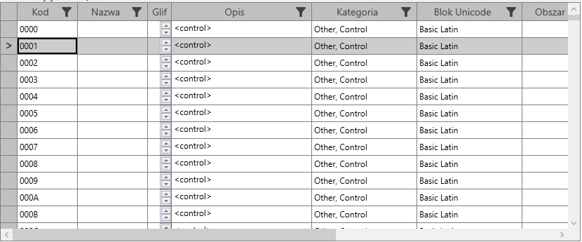
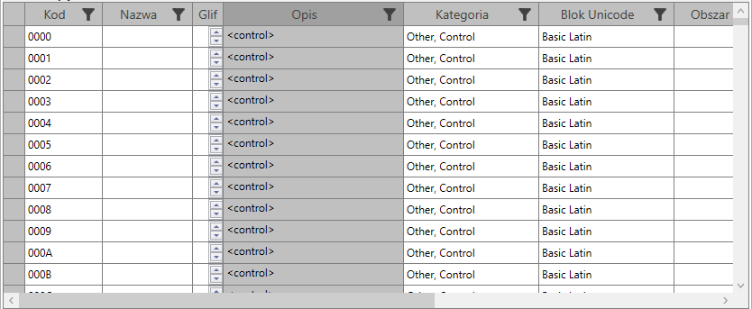
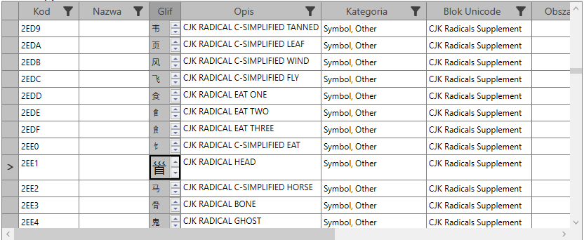
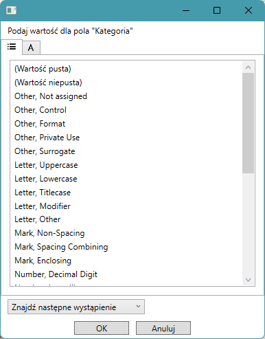
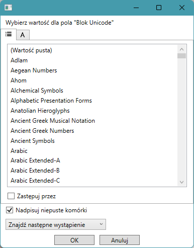

The Qhta.SF.WPF.Tools package is a library that extends the functionality of WPF Syncfusion controls.

*Note: Attempting to name it "Qhta.Syncfusion.WPF.Tools" causes compilation errors due to namespace resolution rules in Visual Studio C#!*

The package contains:
- [Default SfDataGrid styles and templates](#default-sfdatagrid-styles-and-templates),
- [SfDataGrid column and row selection functionality](#SfDataGrid-column-and-row-selection-functionality),
- [Individual SfDataGrid row resizing functionality](#individual-sfdatagrid-row-resizing-functionality),
- [LongTextColumn template and functionality](#longtextcolumn-template-and-functionality),
- [RecordNavigationBar](#recordnavigationbar),
- [Clipboard operations on SfDataGrid](#clipboard-operations-on-sfdatagrid),
- [SfDataGridFinder class and commanding](#sfdatagridfinder-class-and-commanding),
- [Fill Column Command](#fill-column-command),
- [Column Management Command](#column-management-command),
- [Behavior extensions for SfDataGrid and GridColumn classes](#behavior-extensions-for-sfdatagrid-and-gridcolumn-classes).

# Default SfDataGrid styles and templates

The SfDataGridTools resource dictionary contains styles, converters, and data templates that extend the functionality of the original SfDataGrid.
Some style resources only contain specific default property setters, while others are extracted from the original Syncfusion.SfGrid.WPF resources and extended with new templates.
The source code for the resource dictionary is also available in the SfDataGridTools.cs file.

The styles used provide an SfDataGrid layout with a grayed-out row of column headers and a grayed-out column of row headers.



## Default SfDataGrid style settings

The default style for SfDataGrid is defined as below:

```xml
  <Style TargetType="sf:SfDataGrid">
    <Setter Property="AllowDraggingColumns" Value="True" />
    <Setter Property="AllowEditing" Value="True" />
    <Setter Property="AllowFiltering" Value="True" />
    <Setter Property="AllowResizingColumns" Value="True" />
    <Setter Property="AllowSorting" Value="True" />
    <Setter Property="AllowTriStateSorting" Value="True" />
    <Setter Property="AllowDeleting" Value="True" />
    <Setter Property="ColumnSizer" Value="Auto" />
    <Setter Property="HeaderRowHeight" Value="26" />
    <Setter Property="AutoGenerateColumns" Value="False" />
    <Setter Property="GridValidationMode" Value="InEdit" />
    <Setter Property="EditTrigger" Value="OnTap" />
    <Setter Property="EnableDataVirtualization" Value="True" />
    <Setter Property="GridCopyOption" Value="CopyData,IncludeFormat" />
    <Setter Property="SelectionUnit" Value="Any" />
    <Setter Property="SelectionMode" Value="Extended" />
    <Setter Property="ShowRowHeader" Value="True" />
    <Setter Property="tools:SfDataGridBehavior.AllowColumnManagement" Value="True" />
    <EventSetter Event="Loaded" Handler="DataGrid_OnLoaded"/>
    <EventSetter Event="KeyDown" Handler="DataGrid_OnKeyDown"/>
  </Style>
```

Both event handlers are implemented in the code-behind in the SfDataGridTools.xaml.cs file.

### SfDataGrid OnLoaded event handler

The SfDataGrid Loaded event is needed to initialize these event handlers, which are not RoutedEvent handlers
and cannot be initialized in XAML. The GridCopyContent and GridPasteContent event handlers must also be initialized.

```csharp
  private void DataGrid_OnLoaded(object? sender, EventArgs e)
  {
    if (sender is not SfDataGrid dataGrid)
      return;
    dataGrid.QueryRowHeight += DataGrid_OnQueryRowHeight;
    // Attach event handlers for copy and paste operations
    dataGrid.GridCopyContent += DataGrid_OnGridCopyContent;
    dataGrid.GridPasteContent += DataGrid_OnGridPasteContent;
  }
```
Unlike the events described above, the KeyDown event is a RoutedEvent and is initiated in the default SfDataGrid style (see above).

### SfDataGrid OnQueryRowHeight event handler

QueryRowHeight simply calls the OnQueryRowHeight method of the static RowHeightProvider class. 
This method checks whether the corresponding record in the SfDataGrid.View.Records collection 
implements the IRowHeightProvider interface and sets the event's "Height" property to the RowHeight value. 
If this value is not NaN, the event is simply handled.

If the QueryRowHeight event is not handled by the RowHeightProvider, 
then SfDataGrid calls the OnQueryRowHeight method of the LongTextColumn class (both classes are described below).

```csharp
  private void DataGrid_OnQueryRowHeight(object? sender, QueryRowHeightEventArgs e)
  {
    RowHeightProvider.OnQueryRowHeight(sender, e);
    if (e.Handled)
      return;
    LongTextColumn.OnQueryRowHeight(sender, e);
  }
```

### SfDataGrid OnGridCopyContent and OnGridPasteContent event handlers

These handlers use the static SfDataGridCommander class and its CanCopyData, CopyData, CanPasteData, and PasteData parameters.

These handlers are needed because, under certain (and not entirely clear) conditions, the internal logic of SfDataGrid 
attempts to copy or paste data, bypassing the Copy and Paste commands.

```csharp
  private void DataGrid_OnGridCopyContent(object? sender, GridCopyPasteEventArgs e)
  {
    if (sender is not SfDataGrid dataGrid)
      return;
    if (SfDataGridCommander.CanCopyData(dataGrid))
    {
      SfDataGridCommander.CopyData(dataGrid);
      e.Handled = true;
    }
  }

  private void DataGrid_OnGridPasteContent(object? sender, GridCopyPasteEventArgs e)
  {
    if (sender is not SfDataGrid dataGrid)
      return;
    if (SfDataGridCommander.CanPasteData(dataGrid))
    {
      SfDataGridCommander.PasteData(dataGrid);
      e.Handled = true;
    }
  }
```

Please note that the original SfDataGrid did not declare similar CutData or DeleteData events.

### SfDataGrid OnKeyDown event handler

This method handles common command shortcuts:
- Ctrl-C key combination to call SfDataGridCommander.CopyData method,
- Ctrl-X key combination to call SfDataGridCommander.CutData method,
- Ctrl-V key combination to call SfDataGridCommander.PasteData method,
- Delete key to call SfDataGridCommander.DeleteData method,
- Ctrl-F key combination to call FindCommand.Execute method,
- F3 key to call FindCommand.ExecuteNext method.

```csharp
  private void DataGrid_OnKeyDown(object sender, KeyEventArgs e)
  {
    if (sender is not SfDataGrid dataGrid)
      return;
    FindAndReplaceCommand findCommand;
    switch (e.Key)
    {
      case Key.C when Keyboard.Modifiers == ModifierKeys.Control:
        SfDataGridCommander.CopyData(dataGrid);
        e.Handled = true;
        return;
      case Key.X when Keyboard.Modifiers == ModifierKeys.Control:
        SfDataGridCommander.CutData(dataGrid);
        e.Handled = true;
        return;
      case Key.V when Keyboard.Modifiers == ModifierKeys.Control:
        SfDataGridCommander.PasteData(dataGrid);
        e.Handled = true;
        return;
      case Key.Delete when Keyboard.Modifiers == ModifierKeys.None:
        SfDataGridCommander.DeleteData(dataGrid);
        e.Handled = true;
        return;
      case Key.F when Keyboard.Modifiers == ModifierKeys.Control:
        findCommand = new FindAndReplaceCommand();
        if (findCommand.CanExecute(dataGrid))
        {
          findCommand.Execute(dataGrid);
          e.Handled = true;
        }
        return;
      case Key.F3 when Keyboard.Modifiers == ModifierKeys.None:
        findCommand = new FindAndReplaceCommand();
        if (findCommand.CanExecuteFindNext(dataGrid))
        {
          findCommand.ExecuteFindNext(dataGrid);
          e.Handled = true;
        }
        return;
    }
  }

```


# SfDataGrid Column and row selection functionality

The original SfDataGrid allows the user to select cells or entire rows. It lacks column selection.

## The whole SfDataGrid column selection



The default styles for GridHeaderCellControl and GridCellControl are defined to allow the application to select grid columns
and mark them with a gray background.

When nothing is selected, the column header row and row header column appear on a silver background with a graphite background,
and the grid cell background is transparent.

When a column is selected, the background of its header cell turns dark gray and the background of its cells turns silver.

The corresponding styles are named "SelectedColumnHeaderStyle," "SelectedGridCellStyle," and "UnselectedGridCellStyle."
The default GridHeaderCellControl style has no name (which is required for default styles).

```xml
  <Style TargetType="sf:GridHeaderCellControl">
    <Setter Property="Foreground" Value="#FF404040" />
    <Setter Property="Background" Value="Silver" />
    <EventSetter Event="PreviewMouseDown" Handler="GridHeaderCellControl_MouseLeftButtonDown" />
    <EventSetter Event="PreviewMouseDown" Handler="GridHeaderCellControl_MouseRightButtonDown"  />  
  </Style>

  <Style TargetType="sf:GridHeaderCellControl" x:Key="SelectedColumnHeaderStyle">
    <Setter Property="Foreground" Value="#FF404040" />
    <Setter Property="Background" Value="#FFA0A0A0" />
    <EventSetter Event="PreviewMouseDown" Handler="GridHeaderCellControl_MouseLeftButtonDown" />
    <EventSetter Event="PreviewMouseDown" Handler="GridHeaderCellControl_MouseRightButtonDown"  />
  </Style>

  <Style TargetType="sfx:GridCell" x:Key="UnselectedGridCellStyle">
    <Setter Property="Background" Value="Transparent" />
  </Style>

  <Style TargetType="sfx:GridCell" x:Key="SelectedGridCellStyle">
    <Setter Property="Background" Value="Silver" />
  </Style>

```

The GridHeaderCellControl style handles the MouseLeftButtonDown event, allowing the user to select an entire column by clicking the column header cell.
The code method is quite complex because we need to allow the user to click the filter button and the sorting marker to the right of the header cell.
If the column allows filtering, we set the right margin limit to 20 pcx, and if the column allows sorting, we add another 20 pcx to the right margin limit.
We also need to allow the user to resize the columns by dragging their left edges, so we set a small (5 pcx) left margin limit.
Mouse clicks will still only be handled if their position is between the left and right margin limits.

```csharp
  private void GridHeaderCellControl_MouseLeftButtonDown(object sender, MouseButtonEventArgs e)
  {
    if (sender is GridHeaderCellControl headerCellControl && e.ChangedButton == MouseButton.Left)
    {
      var column = headerCellControl.Column;
      if (column == null) return;
      var dataGrid = headerCellControl.FindParent<SfDataGrid>();
      if (dataGrid == null) return;
      if (column.AllowFiltering || column.AllowSorting)
      {
        var rightMarginLimit = 0;
        if (column.AllowFiltering)
          // If the column allows filtering, we can check if the mouse is on the filter icon
          rightMarginLimit += 20; // Assuming the filter icon is 20px wide
        if (column.AllowSorting)
          // If the column allows sorting, we can check if the mouse is on the sort icon
          rightMarginLimit += 20; // Assuming the sort icon is 20px wide
        // Small margins are used to avoid accidental selection when clicking near the left or right edge of the header cell
        if (rightMarginLimit == 0)
          rightMarginLimit = ResizeMargin;
        var leftMarginLimit = ResizeMargin; // Assuming a small margin on the left side
        var mousePosition = e.GetPosition(headerCellControl);
        if (mousePosition.X >= headerCellControl.ActualWidth - rightMarginLimit)
          // If mouse is on the filter icon, do open filter popup instead of selecting the column
          return;
        if (mousePosition.X <= leftMarginLimit)
          // If mouse is near the left edge, do not select the column.
          // Instead, the user may click on the column separator line to resize the column.
          return;
      }
```

We use SfDataGridColumnBehavior to mark a column as selected.
We don't use the SfDataGrid.SelectionController to select all cells in a column individually for two reasons.
First, for selection performance reasons. When a data grid contains a large number of rows, selecting all cells in a column takes a long time.
Second, we want to allow the application to load data from the grid in the background.
If we selected the column cells individually, cells in rows whose data hasn't been loaded yet would remain unselected.
Instead, we use the data grid's SelectionController to clear the selection if some cells are individually selected.

```csharp
      dataGrid.SelectionController.ClearSelections(false);
      var isSelected = SfDataGridColumnBehavior.GetIsSelected(column);
      isSelected = !isSelected;
```

Next, we handle keyboard modifiers like Shift and Control.
If neither is pressed, only the currently clicked column is selected, and the other columns are deselected.
If only the Control modifier key is pressed, no other columns are deselected.
If the Shift modifier key is pressed (and the Control key is not pressed),
all columns between the currently clicked column and the previously selected columns are selected.
Because columns are represented by an indexed collection, we find the last previously (left) index of the selected column and the first next (right) index of the selected column.
If previously selected columns were both to the left and right of the currently clicked column,
all columns between the current and the next one are marked as selected.

```csharp
      if (!Keyboard.Modifiers.HasFlag(ModifierKeys.Shift) && !Keyboard.Modifiers.HasFlag(ModifierKeys.Control))
        // Clear selection if Shift or Control is not pressed
        foreach (var col in dataGrid.Columns)
          if (col != column)
            SfDataGridColumnBehavior.SetIsSelected(col, false);
      if (Keyboard.Modifiers == ModifierKeys.Shift && isSelected)
      {
        var selectedColumnIndex = dataGrid.Columns.IndexOf(column);
        int? lastPriorSelectedColumnIndex = null;
        int? firstNextSelectedColumnIndex = null;
        for (var i = 0; i < dataGrid.Columns.Count; i++)
        {
          var col = dataGrid.Columns[i];
          if (SfDataGridColumnBehavior.GetIsSelected(col))
          {
            if (i < selectedColumnIndex) lastPriorSelectedColumnIndex = i;
            else if (i > selectedColumnIndex) firstNextSelectedColumnIndex = i;
          }
        }
        if (lastPriorSelectedColumnIndex != null || firstNextSelectedColumnIndex != null)
        {
          if (lastPriorSelectedColumnIndex != null && (firstNextSelectedColumnIndex == null ||
                                                          firstNextSelectedColumnIndex - selectedColumnIndex >=
                                                          selectedColumnIndex - lastPriorSelectedColumnIndex))
            // Select all columns from last previous selected to current
            for (var i = lastPriorSelectedColumnIndex.Value + 1; i < selectedColumnIndex; i++)
            {
              var col = dataGrid.Columns[i];
              if (col != column) SfDataGridColumnBehavior.SetIsSelected(col, isSelected);
            }
          if (firstNextSelectedColumnIndex != null && (lastPriorSelectedColumnIndex == null ||
                                                       firstNextSelectedColumnIndex - selectedColumnIndex >=
                                                       selectedColumnIndex - lastPriorSelectedColumnIndex))
            // Select all columns from current to first next selected
            for (var i = selectedColumnIndex + 1; i < firstNextSelectedColumnIndex.Value; i++)
            {
              var col = dataGrid.Columns[i];
              if (col != column) SfDataGridColumnBehavior.SetIsSelected(col, isSelected);
            }
        }
      }

      //Debug.WriteLine($"GridColumnBehavior.IsSelected: {isSelected} for column: {column.MappingName}");
      SfDataGridColumnBehavior.SetIsSelected(column, isSelected);
      e.Handled = true;
    }
  }
```

The SfDataGridColumnConverter class is used to provide a mechanism to retrieve the "IsSelected" property of a GridColumn object for data binding in an SfDataGrid.

```csharp
public class SfDataGridColumnConverter: IValueConverter
{
  public object? Convert(object? value, Type targetType, object? parameter, CultureInfo culture)
  {
    if (value is GridColumn column)
    {
      if (parameter is not string propName)
        throw new InvalidOperationException("Parameter should be string");
      if (propName == "IsSelected")
        return SfDataGridColumnBehavior.GetIsSelected(column);
      else
        throw new InvalidOperationException("Property name not recognized");
    }
    throw new NotImplementedException();
  }
```

## The whole SfDataGrid row selection

Selecting an entire row is handled by the original SfDataGrid class, so we don't need to do it in SfDataGridTools.
If the SelectionUnit property of the SfDataGrid class is set to Any, then when the user clicks the row header, all cells in the row will be selected.

## The whole data selection

The user can select all data in a data grid by clicking a "cell" at the intersection of the column and row headers and the row header columns. 
This cell control type is GridRowIndencCell, and its style, declared in the SfDataGridTools resource dictionary, sets the MouseLeftButtonDown event handler.

```xml
  <Style TargetType="sf:GridRowHeaderIndentCell">
    <Setter Property="Background" Value="Silver" />
    <EventSetter Event="PreviewMouseDown" Handler="GridRowHeaderIndentCell_MouseLeftButtonDown" />
  </Style>
```

Its code implementation simply selects or deselects all columns in the data grid. 
It uses the AreAllColumnSelected and SelectAllColumns extension methods implemented in the SfDataGridSelector static class.

```csharp
  private void GridRowHeaderIndentCell_MouseLeftButtonDown(object sender, MouseButtonEventArgs e)
  {
    if (sender is GridRowHeaderIndentCell indentCell && e.ChangedButton == MouseButton.Left)
    {
      var dataGrid = indentCell.FindParent<SfDataGrid>();
      if (dataGrid == null) return;

      dataGrid.SelectAllColumns(!dataGrid.AreAllColumnsSelected());
      e.Handled = true;
    }
  }
```

# Individual SfDataGrid row resizing functionality

SfDataGrid has an AllowResizingColumns property that allows the user to resize columns by dragging their edges, but it does not have an AllowsResizingRows property.

The original SfDataGrid allows the application to estimate the height of individual rows using the QueryRowHeight event, 
but it lacks user-defined functionality for manipulating heights.

To fill this gap, we defined a control called RowResizer (as a child of the Thumb control).

```xml
  <Style x:Key="{x:Type tools:RowResizer}" Style.TargetType="{x:Type tools:RowResizer}" >
    <Setter Property="Control.Background" Value="#01000000" />
    <Setter Property="Control.Template">
      <Setter.Value>
        <ControlTemplate ControlTemplate.TargetType="{x:Type tools:RowResizer}">
          <Border BorderBrush="{TemplateBinding Control.BorderBrush}" 
                  BorderThickness="{TemplateBinding Control.BorderThickness}" 
                  Background="{TemplateBinding Control.Background}"/>
        </ControlTemplate>
      </Setter.Value>
    </Setter>
  </Style>
```

The dependency properties of this control are: 
- MinRowHeight - set by default to 24,
- MaxRowHeight - set by default to 120.

```csharp
  public static readonly DependencyProperty MinRowHeightProperty =
    DependencyProperty.Register(nameof(MinRowHeight), typeof(double), typeof(RowResizer), new FrameworkPropertyMetadata(24.0));

  public double MinRowHeight
  {
    [DebuggerStepThrough] get => (double)GetValue(MinRowHeightProperty);
    set => SetValue(MinRowHeightProperty, value);
  }
  public static readonly DependencyProperty MaxRowHeightProperty =
    DependencyProperty.Register(nameof(MaxRowHeight), typeof(double), typeof(RowResizer), new FrameworkPropertyMetadata(120.0));

  public double MaxRowHeight
  {
    [DebuggerStepThrough] get => (double)GetValue(MaxRowHeightProperty);
    set => SetValue(MaxRowHeightProperty, value);
  }
```

The RowResizer control supports LeftMouseDown, MouseMove, and LeftMouseUp functions, allowing the user to drag the control.
To resize a row, its dataContext must implement the IRowHeightProvider interface.
This interface declares a single RowHeight property to store the current row height.

```csharp
  private static void OnMouseLeftButtonDown(object sender, MouseButtonEventArgs e)
  {
    if (sender is RowResizer rowResizer && e.ChangedButton == MouseButton.Left)
    {
      var rowHeaderCell = rowResizer.FindParent<GridRowHeaderCell>();
      if (rowHeaderCell == null) return;
      var dataGrid = rowHeaderCell.FindParent<SfDataGrid>();
      if (dataGrid == null) return;

      if (rowResizer.DataContext is not IRowHeightProvider) return;

      var position = e.GetPosition(rowResizer);
      var actualHeight = rowResizer.ActualHeight;

      if (SfDataGridBehavior.GetAllowRowResizing(dataGrid))
      {
        if (!SfDataGridBehavior.GetIsRowResizing(dataGrid))
        {
          // If the grid allows row resizing and is not currently resizing rows, set the state to resizing
          SfDataGridBehavior.SetStartOffset(dataGrid, actualHeight - position.Y);
          SfDataGridBehavior.SetIsRowResizing(dataGrid, true);
          Mouse.Capture(rowResizer);
          e.Handled = true;
        }
      }
    }
  }
```

```csharp
  private static void OnMouseMove(object sender, MouseEventArgs e)
  {
    if (sender is RowResizer rowResizer)
    {
      var rowHeaderCell = rowResizer.FindParent<GridRowHeaderCell>();
      if (rowHeaderCell == null) return;
      var dataGrid = rowHeaderCell.FindParent<SfDataGrid>();
      if (dataGrid == null) return;

      if (rowHeaderCell.DataContext is not IRowHeightProvider rowHeightProvider)
        return;

      if (SfDataGridBehavior.GetIsRowResizing(dataGrid))
      {
        var position = e.GetPosition(rowHeaderCell);
        var requestedHeight = position.Y + SfDataGridBehavior.GetStartOffset(dataGrid);
        if (!double.IsNaN(rowResizer.MinRowHeight) && requestedHeight < rowResizer.MinRowHeight)
          requestedHeight = rowResizer.MinRowHeight;
        if (!double.IsNaN(rowResizer.MaxRowHeight) && requestedHeight > rowResizer.MaxRowHeight)
          requestedHeight = rowResizer.MaxRowHeight;

        rowHeightProvider.RowHeight = requestedHeight;
        e.Handled = true;
        dataGrid.View.Refresh();
      }
    }
  }
```

```csharp
  private static void OnMouseLeftButtonUp(object sender, MouseButtonEventArgs e)
  {
    if (sender is RowResizer rowResizer && e.ChangedButton == MouseButton.Left)
    {
      var rowHeaderCell = rowResizer.FindParent<GridRowHeaderCell>();
      if (rowHeaderCell == null) return;
      var grid = rowHeaderCell.FindParent<SfDataGrid>();
      if (grid == null) return;

      if (SfDataGridBehavior.GetIsRowResizing(grid))
      {
        SfDataGridBehavior.SetIsRowResizing(grid, false);
        Mouse.Capture(null);
        e.Handled = true;
      }
    }
  }
```

An application can enable row resizing using the SfDataGridBehavior AllowRowResizing attached property.
The RowResizer control uses the SfDataGridBehavior IsRowResizing attached property to indicate the state between the LeftMouseDown and LeftMouseUp keys
and allows the user to drag the border between rows.

The new GridRowHeaderCell style is called "ResizedGridRowHeaderCellStyle."
It differs from the original GridRowHeaderCellStyle in that it contains the "PART_RowHeaderIndicatorGrid" content, to which we have added the RowResizer.

If the PART_RowHeaderIndicatorGrid control is visible, the height of the corresponding row can be increased or decreased
by dragging the bottom edge of the row header cell up or down.

```xml
  <Style TargetType="{x:Type sf:GridRowHeaderCell}" x:Key="ResizedGridRowHeaderCellStyle" >
    <Setter Property="Background" Value="Silver" />
    <Setter Property="BorderBrush" Value="#FF808080" />
    <Setter Property="BorderThickness" Value="0,0,1,1" />
    <Setter Property="Foreground" Value="#FF303030" />
    <Setter Property="Padding" Value="0,0,0,0" />
    <Setter Property="FocusVisualStyle" Value="{x:Null}" />
    <Setter Property="IsTabStop" Value="False" />
    <Setter Property="RowErrorMessage" Value="{Binding ErrorMessage}" />
    <Setter Property="Template">
      <Setter.Value>
        <ControlTemplate>
          <Border Name="PART_RowHeaderCellBorder" Background="{TemplateBinding Background}" BorderBrush="{TemplateBinding BorderBrush}" BorderThickness="{TemplateBinding BorderThickness}">
            ...
            <Grid x:Name="PART_RowHeaderIndicatorGrid" Panel.Background="#00FFFFFF">
              <Path x:Name="PART_RowHeaderIndicator" 
                    Width="8.146" 
                    Height="8.146" 
                    HorizontalAlignment="Center" 
                    VerticalAlignment="Center" 
                    Fill="#FF303030" 
                    Stretch="Fill" />
              <tools:RowResizer Visibility="{Binding Path=(tools:SfDataGridBehavior.AllowRowResizing), 
                         RelativeSource={RelativeSource AncestorType={x:Type sf:SfDataGrid}}, 
                         Converter={StaticResource BoolToVisibilityConverter}}" />
              <ToolTipService.ToolTip>
                <ToolTip Name="PART_ToolTip" Background="#FFDB000C" Placement="Left" 
                           PlacementRectangle="20,0,0,0" Tag="{TemplateBinding sf:GridRowHeaderCell.RowErrorMessage}" 
                           Template="{DynamicResource ValidationToolTipTemplate}" Visibility="Collapsed"/>
              </ToolTipService.ToolTip>
            </Grid>
          </Border>
        </ControlTemplate>
      </Setter.Value>
    </Setter>
  </Style>
```

Because the current row height is stored in the RowHeight property of the row data context, this functionality requires 
that the data grid handle the QueryRowHeight event. This event handling is implemented in the source code in the SfDataGridTools.cs file.

```csharp
  private void DataGrid_OnQueryRowHeight(object? sender, QueryRowHeightEventArgs e)
  {
    RowHeightProvider.OnQueryRowHeight(sender, e);
    if (e.Handled)
      return;
    LongTextColumn.OnQueryRowHeight(sender, e);
  }
```

Resizing a single row can be useful when you want to temporarily increase the height of a row, as in the example below.



# LongTextColumn template and functionality

The original WPF Syncfusion library defines several column types. One of these is GridTextColumn, which operates on String data. 
However, its cell template is limited to simple text field functionality, which is insufficient if the cell string is long.

The LongTextColumn class was intended as an extension of the original GridTextColumn class. 
However, since we need to define a new template, it is declared as an extension of the GridTemplateColumn class.

```csharp
public class LongTextColumn : GridTemplateColumn
{
  public LongTextColumn()
  {
    CellTemplate = (DataTemplate)Application.Current.Resources["LongTextCellTemplate"]!;
    EditTemplate = (DataTemplate)Application.Current.Resources["LongTextEditTemplate"]!;
  }
```

The LongTextColumn function provides advanced functionality for SfDataGrid columns, which are mapped to string properties with no length limit. 
When a column is wide enough to display all text content, its layout is identical to that of a GridTextColumn. 
When the text exceeds a single line, a button with a downward-pointing triangle appears to the right of the cell. 
The user can click the button to display a text pop-up window displaying the entire text. 
The pop-up window remains open until the user clicks the upward-pointing triangle button in the upper-right corner of the pop-up window or selects another cell. 
The pop-up window also appears when the user begins editing. Its height increases as the user adds more text.

Two data templates are defined for a LongTextColumn control:
- LongTextCellTemplate for displaying the text,
- LongTextEditTemplate for editing.

```xml
  <DataTemplate x:Key="LongTextCellTemplate">
    <Grid>
      <Grid.ColumnDefinitions>
        <ColumnDefinition Width="*"/>
        <ColumnDefinition Width="Auto"/>
      </Grid.ColumnDefinitions>
      <TextBlock 
        x:Name="LongTextBlock"
        Padding="3"
        TextWrapping="Wrap">
        <TextBlock.Text>
          <MultiBinding Converter="{StaticResource GridColumnMappingConverter}">
            <Binding Path="DataContext" 
                     RelativeSource="{RelativeSource AncestorType={x:Type sfx:GridCell}}" />
            <Binding Path="ColumnBase.GridColumn.MappingName" 
                     RelativeSource="{RelativeSource AncestorType={x:Type sfx:GridCell}}" />
          </MultiBinding>
        </TextBlock.Text>
      </TextBlock>
      <Button 
        Grid.Column="1"
        x:Name="ShowPopupButton"
        Height="20"
        VerticalAlignment="Top"
        Background="Transparent"
        BorderThickness="0"
        BorderBrush="Transparent"
        Content="▼"
        Click="ShowPopupButton_Click">
        <Button.Visibility>
          <MultiBinding Converter="{StaticResource LongTextColumnExpanderVisibilityConverter}">
            <Binding Path="DataContext" 
                     RelativeSource="{RelativeSource AncestorType={x:Type sfx:GridCell}}" />
            <Binding Path="ColumnBase.GridColumn.MappingName" 
                     RelativeSource="{RelativeSource AncestorType={x:Type sfx:GridCell}}" />
            <Binding BindsDirectlyToSource="True" 
                     RelativeSource="{RelativeSource AncestorType={x:Type sfx:GridCell}}" />
          </MultiBinding>
        </Button.Visibility>
      </Button>
      <Popup Grid.Column="0" Grid.ColumnSpan="2" x:Name="LongTextPopup" Placement="Mouse" StaysOpen="false">
        <Border Background="LightGray" BorderBrush="Black" BorderThickness="1" Padding="3" >
          <Grid>
          <Grid.ColumnDefinitions>
            <ColumnDefinition Width="*"/>
            <ColumnDefinition Width="Auto"/>
          </Grid.ColumnDefinitions>
            <TextBlock 
              TextWrapping="Wrap">
              <TextBlock.Text>
                <MultiBinding Converter="{StaticResource GridColumnMappingConverter}">
                  <Binding Path="DataContext" 
                           RelativeSource="{RelativeSource AncestorType={x:Type sfx:GridCell}}" />
                  <Binding Path="ColumnBase.GridColumn.MappingName" 
                           RelativeSource="{RelativeSource AncestorType={x:Type sfx:GridCell}}" />
                </MultiBinding>
              </TextBlock.Text>
            </TextBlock>
          <Button 
            Grid.Column="1"
            x:Name="HidePopupButton"
            Height="20"
            VerticalAlignment="Top"
            Background="Transparent"
            BorderThickness="0"
            BorderBrush="Transparent"
            Content="▲"
            Click="HidePopupButton_Click">
            <Button.Visibility>
              <MultiBinding Converter="{StaticResource LongTextColumnExpanderVisibilityConverter}">
                <Binding Path="DataContext" 
                         RelativeSource="{RelativeSource AncestorType={x:Type sfx:GridCell}}" />
                <Binding Path="ColumnBase.GridColumn.MappingName" 
                         RelativeSource="{RelativeSource AncestorType={x:Type sfx:GridCell}}" />
                <Binding BindsDirectlyToSource="True" 
                         RelativeSource="{RelativeSource AncestorType={x:Type sfx:GridCell}}" />
              </MultiBinding>
            </Button.Visibility>
          </Button>

          </Grid>
        </Border>
      </Popup>
    </Grid>
  </DataTemplate>
```
The LongTextEditTemplate template differs from the LongTextCell template in that the text block replaces the text block in the popup. 
The binding is bidirectional, and the UpdateSourceTrigger is changed depending on the property.

```xml
          <TextBox 
            Padding="0"
            TextWrapping="Wrap"
            BorderBrush="Transparent"
            BorderThickness="0"
            AcceptsReturn="True"
            AcceptsTab="True"
            >
            <TextBox.Text>
              <MultiBinding Converter="{StaticResource GridColumnMappingConverter}" Mode="TwoWay" UpdateSourceTrigger="PropertyChanged">
                <Binding Path="DataContext" 
                         RelativeSource="{RelativeSource AncestorType={x:Type sfx:GridCell}}" />
                <Binding Path="ColumnBase.GridColumn.MappingName" 
                         RelativeSource="{RelativeSource AncestorType={x:Type sfx:GridCell}}" />
              </MultiBinding>
            </TextBox.Text>
          </TextBox>
```

Both templates use two specially-defined value converters:
- GridColumnMappingConverter and
- LongTextColumnExpanderVisibilityConverter.

These converters accept the name of the bound property, which is stored in the column's MappingName property.
The first converter returns the name of the bound property.
It implements the IMultiValueConverter interface, but not the IValueConverter interface due to two-way binding (needed for editing).

```csharp
public class GridColumnMappingConverter : IMultiValueConverter
{
  public object? Convert(object?[]? values, Type targetType, object? parameter, CultureInfo culture)
  {
    if (values == null || values.Length < 2)
      return null;

    var dataContext = values[0];
    var propertyName = values[1]?.ToString();

    if (dataContext == null || string.IsNullOrEmpty(propertyName))
      return null;

    // Use reflection to get the property value dynamically
    var property = dataContext.GetType().GetProperty(propertyName);
    return property?.GetValue(dataContext);
  }
```

The second converter also implements the IMultiValueConverter interface, although it returns a Visibility value for hiding and displaying the ShowPopupButton.
This could be an implementation of the IValueConverter interface, but it copies much of the code from GridColumnMappingConverter.
To determine whether the ShowPopupButton should be visible or collapsed, it uses the EvaluateTextHeight method of the LongTextColumn class.

```csharp
public class LongTextColumnExpanderVisibilityConverter : IMultiValueConverter
{
  public object? Convert(object?[]? values, Type targetType, object? parameter, CultureInfo culture)
  {
    if (values == null || values.Length < 3)
      return null;

    var dataContext = values[0];
    var propertyName = values[1]?.ToString();

    if (dataContext == null || string.IsNullOrEmpty(propertyName))
      return null;

    // Use reflection to get the property value dynamically
    var property = dataContext.GetType().GetProperty(propertyName);
    var value = property?.GetValue(dataContext);
    if (value is string longText && values[2] is GridCell cell && cell.ColumnBase.GridColumn is LongTextColumn column)
    {
      var cellHeight = column.EvaluateTextHeight(longText); 
      return cellHeight>cell.ActualHeight ? System.Windows.Visibility.Visible : System.Windows.Visibility.Collapsed;
    }
    return System.Windows.Visibility.Collapsed; // Default to collapsed if conditions are not met
  }
```

# RecordNavigationBar

RecordNavigationBar is a control displayed under SfDataGrid that helps the user navigate through records.

 

It presents (from the left):
- a button to go to the first record,
- a button to go to the previous record,
- current record index (numbered from one),
- total records number,
- a button to go to the next record,
- a button to go to the last record.

The XAML definition of the RecordNavigationBar element uses images (PNG files) to display button icons. 
We tried using Unicode symbols instead, but they vary in size.

```xml
<UserControl x:Class="Qhta.SF.WPF.Tools.RecordNavigationBar"
             xmlns="http://schemas.microsoft.com/winfx/2006/xaml/presentation"
             xmlns:x="http://schemas.microsoft.com/winfx/2006/xaml"
             xmlns:mc="http://schemas.openxmlformats.org/markup-compatibility/2006" 
             xmlns:d="http://schemas.microsoft.com/expression/blend/2008" 
             xmlns:local="clr-namespace:Qhta.SF.WPF.Tools"
             mc:Ignorable="d" 
             DataContext="{Binding RelativeSource={RelativeSource Self}}"
             d:DesignHeight="24" d:DesignWidth="200">
  <Grid>
    <StackPanel Orientation="Horizontal" HorizontalAlignment="Left" >
      <Button Style="{StaticResource FlatButtonStyle}"
              Command="{Binding FirstItemCommand, RelativeSource={RelativeSource AncestorType=UserControl}}" 
              CommandParameter="{Binding DataGrid}" 
              Margin="2,0">
        <Image Source="/Assets/MoveToFirst.png" Height="16"/>
      </Button>
      <RepeatButton Style="{StaticResource FlatButtonStyle}"
              Command="{Binding PreviousItemCommand, RelativeSource={RelativeSource AncestorType=UserControl}}" 
              CommandParameter="{Binding DataGrid}" 
              Margin="2">
        <Image Source="/Assets/MoveToPrevious.png" Height="16"/>
      </RepeatButton>
      <TextBlock Text="{Binding DataGrid.SelectedIndex,
                    Converter={StaticResource AddingConverter},
                    ConverterParameter=1}" 
                 Width="{Binding ElementName=CountTextBlock, Path=ActualWidth}"
                 TextAlignment="Right"
                 Margin="4"/>
      <TextBlock Text=" / " VerticalAlignment="Center"/>
      <TextBlock x:Name="CountTextBlock"
                 Text="{Binding RowsCount}" 
                 TextAlignment="Left"
                 Margin="4"/>
      <RepeatButton Style="{StaticResource FlatButtonStyle}"
              Command="{Binding NextItemCommand, RelativeSource={RelativeSource AncestorType=UserControl}}" 
              CommandParameter="{Binding DataGrid}" 
              Margin="2">
        <Image Source="/Assets/MoveToNext.png" Height="16"/>
      </RepeatButton>
      <Button 
              Style="{StaticResource FlatButtonStyle}"
              Command="{Binding LastItemCommand, RelativeSource={RelativeSource AncestorType=UserControl}}" 
              CommandParameter="{Binding DataGrid}" 
              Margin="2">
        <Image Source="/Assets/MoveToLast.png" Height="16"/>
      </Button>
    </StackPanel>
  </Grid>
</UserControl>
```

Navigation is implemented in code-behind using RelayCommands. An example of LastItemCommand is shown below.
The LastItemExecute method sets the selected data grid index to the last item and makes it visible by scrolling it into view. 
If the data grid is not initialized, the method exits without making any changes.

```csharp
  public RelayCommand LastItemCommand { [DebuggerStepThrough] get; set; }

  public void LastItemExecute()
  {
    var dataGrid = DataGrid;
    if (dataGrid == null)
      return;

    var selectedIndex = RowsCount - 1;

    dataGrid.SelectedIndex = selectedIndex;
    ScrollInView(selectedIndex);
  }
```

Klasa RecorNavigationBar ma zaawansowaną implementację właściwości RowsCount.
Chociaż deklaracja właściwości zależności jest dość prosta,
```csharp
  public static DependencyProperty RowsCountProperty =
    DependencyProperty.Register(nameof(RowsCount), typeof(int), typeof(RecordNavigationBar),
      new PropertyMetadata(null));

  public int RowsCount
  {
    [DebuggerStepThrough] get => (int)GetValue(RowsCountProperty);
    set => SetValue(RowsCountProperty, value);
  }
```

Binding this property to the DataGrid's item source is difficult.
In a primitive implementation, the RowsCountProperty property can be bound to the ItemsSource.Count path.

However, we had to consider three special cases:
- The ItemsSource item count is not a dependency property and does not notify observers of changes.
- The SfDataGrid item source is loaded lazily (in parallel, in a background task).
- SfDataGrid records can be filtered.

In the first case, we cannot rely on the binding mechanism.
In the second case, the RowsCount property should be incremented to show the number of currently loaded records.
In the last case, the RowsCount property should express the number of currently visible rows.

To cover these three cases, we exploit the fact that SfDataGrid.View.Records implements the INotifyCollectionChanged interface
with a CollectionChanged event.

We define an event handler that retrieves SfDataGrid.View.Records.Count and assigns it to the RowsCount property.

We first check whether SfDataGrid.ItemsSource implements the ILoadable interface.
The ILoadable interface is defined in the Qhta.ObservableObjects package. It declares a Boolean IsLoaded property
and a simple Loaded event handler.

```csharp
public interface ILoadable
{
  /// <summary>Determines whether the object is loaded.</summary>
  bool IsLoaded { get; set; }
  /// <summary>Event that is raised when the object is fully loaded.</summary>
  EventHandler? Loaded { get; set; }
}
```

If SfDataGrid.ItemsSource implements the ILoadable interface and is not loaded, we get the current value of dataGrid.View.Records.Count.
We assign its value to RowsCount, but not each value, only the value divided by UpdateDivider.
This dependency property is initially set to 1000 and improves update performance.

```csharp
  private NotifyCollectionChangedEventHandler? ViewOnCollectionChanged(SfDataGrid dataGrid)
  {
    return (s, e) =>
    {
      if (dataGrid.ItemsSource is ILoadable loadable && !loadable.IsLoaded)
      {
        var count = dataGrid.View.Records.Count;
        if (UpdateDivider == 0 || count % UpdateDivider == 0)
          RowsCount = count;
      }
      else
        RowsCount = dataGrid.View.Records.Count;
    };
  }
```

Some issues may arise with event handling, as the dataGrid view may take some time to initialize. We solved this problem using a cascade of three methods.
1. Static DataGridPropertyChanged method is declared as DataGrid property changed callback.
```csharp
  private static void DataGridPropertyChanged(DependencyObject d, DependencyPropertyChangedEventArgs e)
  {
    if (d is RecordNavigationBar recordNavigationBar && e.NewValue is SfDataGrid dataGrid)
    {
      Debug.WriteLine($"DataGrid property set to {dataGrid.Name}");
      recordNavigationBar.DataGridChanged(dataGrid);
    }
  }
```

2. This method passes a call to the DataGridChanged method, which assigns a handler to the Control Loaded event of the dataGrid object.
```csharp
  private void DataGridChanged(SfDataGrid dataGrid)
  {
    dataGrid.Loaded += (s, e) =>
    {
      BindRowsCount(dataGrid);
    };
  }
```

3. The BindRowsCount method checks whether the dataGrid object's View property has just been initialized, and then assigns a ViewCollectionChanged handler. 
If dataGrid.ItemsSource implements ILoadable and the object has not yet been loaded, then the Loaded event handler is initialized to set the final RowsCount value.
```csharp
  private void BindRowsCount(SfDataGrid dataGrid)
  {
    if (dataGrid.View != null)
    {
      if (dataGrid.View.Records != null)
        RowsCount = dataGrid.View.Records.Count;
      dataGrid.View.CollectionChanged += ViewOnCollectionChanged(dataGrid);
    }
    if (dataGrid.ItemsSource is ILoadable loadable && !loadable.IsLoaded)
      loadable.Loaded += (object? sender, EventArgs e) =>
      {
        if (dataGrid.View?.Records != null)
        {
          RowsCount = dataGrid.View.Records.Count;
        }
      };
  }
```

Using a RecordNavigationBar is simple. First, declare a grid with at least two rows (in the example below, there are three rows – the first is used for the main menu).

Then, place the SfDataGrid in the row with a height declared as "*".

Finally, place the RecordNavigationBar in the row below and bind the dataGrid to the DataGrid property.
```xml
  <Grid>
    <Grid.RowDefinitions>
      <RowDefinition Height="Auto"/>
      <RowDefinition Height="*"/>
      <RowDefinition Height="Auto"/>
    </Grid.RowDefinitions>
    <!-- Menu Bar -->
    <Menu Grid.Row="0">
    ...
    </Menu>
    <sf:SfDataGrid x:Name="CodePointDataGrid" 
                     Grid.Row="1"
                     DataContext ="{StaticResource ViewModels}"
                     ItemsSource ="{Binding Instance.UcdCodePoints}"
                     AutoGenerateColumns="False">
    ...
    </sf:SfDataGrid>
    <tools:RecordNavigationBar Grid.Row="2" DataGrid="{Binding ElementName=CodePointDataGrid}"/>
   </Grid>
```

# Clipboard operations on SfDataGrid

The three clipboard commands: Copy, Cut, and Paste are implemented in the SfDataGridCommander class. 
Because the Delete command's implementation is similar to the Cut command, it has been added to the same class.

SfDataGridCommander class is partially encoded in six files:
- SfDataGridCommander!.cs
- SfDataGridCommander.CopyData.cs
- SfDataGridCommander.CutData.cs
- SfDataGridCommander.DeleteData.cs
- SfDataGridCommander.PasteData.cs
- SfDataGridCommander~.DataOp.cs

*Note that "!" and "~" suffixes are used solely to achieve logical file-name sorting.*

The first file contains the basic methods used in the core method implementation. 
The next four files contain methods called directly in the command implementation:
- CanCopyData, CopyData - for Copy command,
- CanCutData, CutData - for Cut command,
- CanDeleteData, DeleteData - for Delete command,
- CanPasteData, PasteData - for Paste command.

Each method has a single parameter of SfDataGrid type.

## Common data operations (Copy, Cut, Delete)

We take advantage of the fact that the three operations Copy, Cut, and Delete share common functionalities.
The methods called for the Copy, Cut, and Delete commands redirect calls to the final file (SfDataGridCommander~.DataOp.cs),
which contains a general implementation of one of the three data operations
(defined as the DataOp enumeration type): Copy, Cut, and Delete.

The methods implementing the Copy command are shown below. The methods for the other three commands are similar.

```cSharp
public static partial class SfDataGridCommander
{
  public static bool CanCopyData(SfDataGrid dataGrid) => CanExecuteDataOp(dataGrid, DataOp.Copy);

  public static void CopyData(SfDataGrid dataGrid) => ExecuteDataOp(dataGrid, DataOp.Copy);
}
```

There are two general methods: CanExecuteDataOp and ExecuteDataOp, which take two parameters:
- one of type SfDataGrid and 
- one of type DataOp.

They operate on selected columns, rows, or cells of a data grid.
They use the GetSelectedRowsAndColumns method, which returns an array of GridCellInfo of the selected data grid cells.
But they also have four output parameters:
- allColumnsSelected – set to true if and only if all grid columns are selected,
- selectedColumn (as a GridColumn array) – populated with the columns that are currently selected,
- allRowsSelected – set to true if and only if all grid rows are selected,
- selectedRows (as an object array) – populated with the data rows that are currently selected.

```csharp
  public static GridCellInfo[] GetSelectedRowsAndColumns (this SfDataGrid dataGrid, out bool allColumnsSelected, out GridColumn[] selectedColumns, out bool allRowsSelected, out object[] selectedRows)
  {
    allColumnsSelected = false;
    var selectedCells = dataGrid.GetSelectedCells().Where(cell => !cell.Column.IsHidden).ToArray();
    if (selectedCells.Length != 0)
      selectedColumns = selectedCells.Select(cell => cell.Column).Distinct().ToArray();
    else
      selectedColumns = dataGrid.Columns.Where(column => !column.IsHidden && SfDataGridColumnBehavior.GetIsSelected(column)).ToArray();

    if (!selectedColumns.Any())
      selectedColumns = dataGrid.Columns.Where(column => !column.IsHidden).ToArray();
    else if (selectedColumns.Length == dataGrid.Columns.Count(column => !column.IsHidden))
      allColumnsSelected = true;

    allRowsSelected = false;
    if (selectedCells.Length != 0)
      selectedRows = selectedCells.Select(cell => cell.RowData).Distinct().ToArray();
    else
      selectedRows = dataGrid.SelectionController.SelectedRows.Select(row => row.RowData).ToArray();

    if (!selectedRows.Any())
      selectedRows = dataGrid.View.Records.Select(record => record.Data).ToArray();
    if (selectedRows.Length == 0)
      return selectedCells;
    if (selectedRows.Length == dataGrid.View.Records.Count())
      allRowsSelected = true;

    return selectedCells;
  }
```

They also use the GetRowDataType method, which returns the type of the grid items.View.SourceCollection.

```csharp
  public static Type? GetRowDataType(SfDataGrid dataGrid)
  {
    var itemsSource = dataGrid.View?.SourceCollection;
    if (itemsSource == null)
      return null;

    var itemType = TypeUtils.TypeUtils.GetElementType(itemsSource.GetType());
    return itemType;
  }
```

The GetGridColumnInfos method returns an additional GridColumnInfo array (exposing ValuePropertyInfo and DisplayPropertyInfo).

```csharp
  private static GridColumnInfo?[] GetGridColumnInfos(GridColumn[] columns, Type rowDataType, bool write)
  {
    var columnInfos = columns.Select(column =>
    {
      var mappingPropertyInfo = column.GetType().GetProperty("MappingName");
      if (mappingPropertyInfo == null) return null;
  
      var mappingName = (string?)mappingPropertyInfo.GetValue(column);
      if (mappingName == null) return null;
  
      var valuePropertyInfo = rowDataType.GetProperty(mappingName);
      if (valuePropertyInfo == null) return null;
  
      GridColumnInfo gridColumnInfo = new GridColumnInfo(column, mappingName, valuePropertyInfo);
      if (column is GridComboBoxColumn comboBoxColumn)
      {
        var displayMemberPath = comboBoxColumn.DisplayMemberPath;
        if (!string.IsNullOrEmpty(displayMemberPath))
        {
          var displayPropertyInfo = valuePropertyInfo.PropertyType.GetProperty(displayMemberPath);
          if (displayPropertyInfo == null) return null;
  
          gridColumnInfo.DisplayPropertyInfo = displayPropertyInfo;
        }
        if (write)
          gridColumnInfo.ItemsSource = comboBoxColumn.ItemsSource;
      }
    return gridColumnInfo;
    }).Where(info => info != null).ToArray();
    return columnInfos;
  }

```

Copy and Cut operations create clipboard contents as lines of text.
The first line of content is the header row, which consists of the data grid headers
(HeaderText or MappingName column declarations) separated by tab characters ('\t').
The header row is skipped if only one cell is copied to the clipboard.

```cSharp
      var content = new List<string>();

      if (op == DataOp.Copy || op == DataOp.Cut)
      {
        if (selectedRows.Length != 1 || selectedColumns.Length != 1)
        {
          var headers = GetHeaders(dataGrid, selectedColumns);
          var headerLine = string.Join("\t", headers);
          content.Add(headerLine);
        }
      }
```

Each data row consists of cell data (retrieved via ValuePropertyInfo or DisplayPropertyInfo), also separated by tabs. 
In the main loop, the "Cut" and "Delete" operations set null values ​​for each selected cell when deleting individual cells.

```csharp
        foreach (var row in selectedRows)
        {
          var cellValues = selectedColumns.Select(column =>
          {
            var cellInfo = new GridCellInfo(column, row, null);
            var columnInfo = columnInfos?.FirstOrDefault(info => info?.MappingName == column.MappingName);
            object? cellData = null;
            if (columnInfo != null)
            {
              cellData = GetCellData(cellInfo, columnInfo);
              if (op == DataOp.Cut && !allColumnsSelected)
                SetCellData(cellInfo, columnInfo, null);
            }
            return cellData?.ToString() ?? string.Empty;
          }).ToArray();
          var line = string.Join("\t", cellValues);
          //Debug.WriteLine($"{line}");
          content.Add(line);
```

If you select entire rows, the data records are removed from the data grid item source, which must implement the IList interface.

```cSharp
      if (op == DataOp.Delete)
      {
        if (allColumnsSelected)
          DeleteRecords(dataGrid, selectedRows);
        else
          DeleteCells(selectedColumns, columnInfos, selectedRows);
      }
```

However, when implementing the CanExecuteDataOp method, if the item source implements IRemovableCollection, 
we can check whether we can remove individual records.

```csharp
          if (itemsSource is IRemovableCollection removableCollection)
          {
            if (removableCollection.IsReadOnly)
            {
              Debug.WriteLine($"{op}: Data collection is read-only");
              return false;
            }
            foreach (var item in selectedRows)
            {
              if (!removableCollection.CanRemove(item))
              {
                Debug.WriteLine($"{op}: Item cannot be removed");
                return false;
              }
            }
          }
```
## PasteData operations

The CanPasteData and PasteData methods are implemented directly in the SfDataGridCommander.PasteData.cs file. 
The CanPasteData method simply checks whether there is text on the clipboard.

```cSharp
  public static bool CanPasteData(SfDataGrid dataGrid) => Clipboard.ContainsText();
```
The PasteData method is much more complicated. We assume not only that the clipboard contains text,
but also that this text can be split into rows using the "\r\n" or "\n" separators,
and each row can be split into elements using the "\t" separators.

The first row should contain the column headers (header text), which are compared to the current column headers.

The exception is if the text in the clipboard contains only a single row.
In this case, this row should contain only one value, which is assigned to the current cell.

Otherwise, values ​​are assigned to the appropriate cells.
Values ​​are assigned only to the selected rows.
If there are more rows of data in the clipboard than the number of selected rows, the data rows are repeated from the beginning.

## Undoing clipboard and delete operations

To support undo operations, the UndoRedoManager class (defined in the Qhta.UndoManager library) is used for the PasteData, CutData, and DeleteData operations.

UndoRedoManager allows you to register actions. An action is a class implementing the IAction interface and provides two methods:
- Undo and
- Execute.

Undo is the method that undoes the registered action, and Execute is the method that redoes the action.

To support undo/redo, we must register a new action (with action arguments) before performing the undone operation.

UndoManager defines two classes that implement the IAction interface:
- ChangePropertyAction for undoing/redoing property changes,
- ActionGroup for undoing/redoing multiple operations in one step.

Both are used in DataOp methods (ActionGroup is used indirectly by StartGrouping and StopGrouping).

The ChangePropertyAction is used to delete cells in an SfDataGrid, as deletion is implemented by setting the cell content to null.

However, to undo/redo delete a record, we defined a special IAction implementation in the DelRecordAction class.

This class uses the DelRecordArg record, which holds the action arguments: DataList, Index, and DataObject.

The DelRecordAction code is simple:

```csharp
public class DelRecordAction: IAction
{
  /// <summary>
  /// Deletes a record in a data grid.
  /// </summary>
  /// <param name="args">Must be <see cref="DelRecordArgs"/></param>
  public void Execute(object? args)
  {
    if (args is not DelRecordArgs delRecordArgs)
      throw new ArgumentNullException(nameof(args));
    delRecordArgs.DataList.Remove(delRecordArgs.DataObject);
  }

  /// <summary>
  /// Undo a delete action.
  /// </summary>
  /// <param name="args">Must be <see cref="DelRecordArgs"/></param>
  public void Undo(object? args)
  {
    if (args is not DelRecordArgs delRecordArgs)
      throw new ArgumentNullException(nameof(args));
    if (delRecordArgs.Index.HasValue && delRecordArgs.Index.Value >= 0 && delRecordArgs.Index.Value < delRecordArgs.DataList.Count)
      delRecordArgs.DataList.Insert((int)delRecordArgs.Index, delRecordArgs.DataObject);
    else
      delRecordArgs.DataList.Add(delRecordArgs.DataObject);
  }
}
``` 

DeleteRecords method uses UndoRedoManager StartGrouping method to enable undo/redo in one step.
Before each dataSource Remove call we register a new DelRecordAction with appropriate argumens.
Note that we moved UndoRedo StopGrouping call to finally clause of try-catch-finally instruction
to be sure that it is calld even in case of exception.

```csharp
  private static void DeleteRecords(SfDataGrid dataGrid, object[] selectedRows)
  {
    if (dataGrid.ItemsSource is IList dataSource)
    {
      IErrorMessageProvider? errorMessageProvider = null;
      try
      {
        UndoRedoManager.StartGrouping();
        foreach (var row in selectedRows)
        {
          errorMessageProvider = row as IErrorMessageProvider;
          var delRecordArgs = new DelRecordArgs(dataSource, dataSource.IndexOf(row), row);
          UndoRedoManager.Record(new DelRecordAction(), delRecordArgs);
          dataSource.Remove(row);
        }
      }
      catch (Exception e)
      {
        if (errorMessageProvider != null)
          errorMessageProvider.ErrorMessage = e.Message;
      }
      finally
      {
        if (UndoRedoManager.IsGrouping)
          UndoRedoManager.StopGrouping();
      }
    }
  }

```

# SfDataGridFinder class and commanding

The original Syncfusion framework lacks functionality for finding and replacing values ​​or text. The SfDataGridFinder class (along with several other classes) 
fills this gap by providing a user interface and API for finding and selecting data in an SfDataGrid.



First, we provide a FindAndReplaceCommand class that allows the user to start searching for (and optionally replacing) values ​​or text in SfDataGrid columns. This command can be executed when one and only one column of the grid is selected.

FindAndReplaceCommand has four public methods:
- CanExecute,
- Execute,
- CanExecuteFindNext,
- ExecuteFindNext.

The first two methods support a fully interactive Find/Replace command that opens the SpecificValueWindow in one of two modes:
- Find mode,
- Find and Replace mode.

The last two methods support the Find/Replace Next command, which does not open a dialog box but relies on previous Find/Replace settings.

The opening mode of the SpecificValueWindow can be specified using the FindOrReplaceMode property of the FindAndReplaceCommand instance. This can be one of the following options:
- Auto (default),
- Find,
- Replace.

In Auto mode, the window opening mode is determined by the read/write capabilities of the data grid and column.
In Find mode, the window opening mode is set to Find.
In Replace mode, if the data grid or column does not allow writing, the CanExecute method returns false and the Execute method throws an exception.

Find mode allows the user to select a value and select the search options for the value in the following order:
- FindFirst,
- FindNext,
- FindAll.

In FindFirst mode, the selected value is searched from the beginning of the column (top row). If a match is found, the cell is selected.
If the match is not found, an appropriate message is displayed. In FindNext mode, the selected value is searched for, starting from the next cell (below the current one) in the column.
In FindAll mode, all cells in the column are iterated, and all cells that meet the search criteria are selected.

FindAndReplace mode is similar to Find mode, but allows the selection of a replacement value.

When the user clicks to select a replacement value, a helper box for it is displayed.

During the command execution, cells are not only selected but also replaced with the replacement value.

The SpecifiedValueWindow can operate in one of the following modes:
- Edit mode,
- Selector mode,
- Both modes.

In Edit mode, the SpecificValueWindow displays the SpecificEditView.
The SpecifiedEditView allows the user to edit a specified value in a TextBox.
After selecting the Replace option, the user can also edit the replacement value.

In Selector mode, the SpecificValueSelector view is visible.
The SpecifiedEditSelector allows the user to select a specific value in the list box (ListBox),
and after selecting the Replace option, also select the replacement value.
In Both mode, both views are visible and selectable in the TabControl.

To execute the FindAndReplace command, a special SfDataGridFinder class is defined.

An instance of this class is created and saved for the column when the command is first executed.

SfDataGridFinder stores the SpecifiedValue, ReplacementValue, the Boolean Replace option, and the Boolean Found result.
It also stores the Predicate property using the FilterPredicate class.
The stored Predicate is created in FindFirst and FindAll modes and used in FindNext modes.

We do not use the FilterValue property of the FilterPredicate class.
Instead, the EvaluatePredicate method of the SfDataGridFinder class uses a separate parameter, specificValue.

The EvaluateReplacement method uses separate properties, specificValue and replacementValue.

We use other properties of FilterPredicate:
- the FilterBehavior property to determine whether SpecifiedValue is of type StringTyped or StronglyType,
- the FilterType property to select the comparison operation,
- the IsCaseSensitive property to determine whether SpecifiedValue is case-sensitive in StringTyped mode.
- 
# Fill Column Command

FillColumnCommand uses SpecificValueWindow in fill mode. In this mode, specifying a replacement value is not possible.

The FindInSequence option is also not visible.

Instead, the OverwriteNonEmptyCells option is visible, which allows the execute method to also fill non-empty cells.



# Column Management Command

The original SfDataGrid library includes a class called GridColumnChooserControl.
This is a pop-up window class that allows the user to hide/show individual grid columns.
However, the basic implementation of the control requires the user to drag a column header onto the pop-up window to hide it.
We developed a more traditional mechanism for hiding or showing columns.


ColumnManagementCommand opens a ColumnManagementWindow that displays all the columns in the grid. Column headers are displayed with checkboxes.

The user can choose to hide or show each column by clicking the checkbox.

Furthermore, the ColumnManagementWindow allows the user to change the column display order using the MoveUp/MoveDown buttons or by dragging selected items.

To implement dragging selected items in a ColumnManagementWindow, we had to move the selection and deselection of items to the PreviewLeftButtonUp event handler.

The PreviewLeftButtonDown event handler only stores the starting point of the drag.

If this event also selects/deselects items, it may accidentally deselect the clicked item.

The ColumnManagementCommand can be executed if the SfDataGrid attached property AllowColumnManagement is set to true.

The ColumnManagementCommand can be activated by right-clicking on any column header cell
(but ​​only if the column does not have a context menu assigned).
To achieve this, both styles for the GridHeaderCellControl defined in the SfDataGridTools.Xml file (the default style and the SelectedColumnHeaderStyle)
assign the GridHeaderCellControl_MouseRightButtonDown handler to the PreviewMouseDown event.

# Behavior extensions for SfDataGrid and GridColumn classes

Two classes implementing the Behavior mechanism have been defined:
- SfDataGridBehavior and
- SfDataGridColumnBehavior.

Behavior is a Microsoft extension mechanism for PresentationFramefork controls.

It allows XAML developers to attach new properties to existing controls without having to redefine their classes.

SfDataGridBehavior defines the following properties for SfDataGrid:
- AllowRowResizing – allows rows to be resized by dragging the bottom border or row header cells.
- IsRowResizing – specifies the current row resize state.
- StartOfOffset – stores the distance in pixels between the initial mouse click position and the initial row height.
- AllowColumnManagement – ​​allows the user to execute a ColumnManagementCommand by right-clicking on any column header cell.

The SfDataGridColumnBehavior class defines one attachable property:
- IsSelected.

This property can apply to both GridColumn and GridHeaderCellControl.

When set or get it from a GridHeaderCellControl, its boolean value is stored in the corresponding CellColumn.

There is also a static SfDataGridColumnBehaviorExtensions class.

It defines static methods for storing SfDataGridFinder instances in a GridColumn:
- SetFinder and
- GetFinder.

The SetFinder/GetFinder accessor methods cannot be declared in the SfDataGridColumnBehavior class because it is not static.
